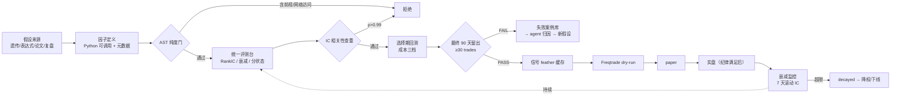

# Fix architecture D003/D010/D016/D019/D020/D002 (@general subagent)

## user · 2026-09-06T16:44:15Z

You are the FIXER in a review-convergence loop for AlphaMill (D:\Projects\alphamill), a crypto quant research system at design stage. Baseline: main @ 1bd8c4d. Language: Chinese, match existing architecture doc style.

YOUR FILE OWNERSHIP (do NOT touch any other file): docs/alphamill-architecture.md ONLY.

First READ docs/alphamill-architecture.md fully + round-1 review report docs/reviews/CURRENT-doc.md (issues D003, D010, D016, D019, D020, and the architecture-side of D002) + docs/alphamill-integration.md §3.2 (merge_asof no-lookahead rules) for context.

MANDATORY — do NOT break: storage trio division (TimescaleDB/Parquet/DuckDB), no-lookahead three layers, interface contracts §4.1-4.4 that already exist (you EXTEND them, never redefine).

DIRECTORY DECISION ALREADY MADE (D010) — propagate exactly this wording: 单一 Python 布局 = src/alphamill/<module>/（src-layout 已由 pyproject `[tool.hatch.build.targets.wheel] packages = ["src/alphamill"]` 固化）。概念模块名作为子包名：alphamill/data_bridge、alphamill/factor_factory、alphamill/validation、alphamill/kronos_service 等；非 Python 资产（docker-compose、deployment/ 运维脚本、docs/）留在仓库根，不进包。所有"平铺目录"（data_bridge/、factor_factory/…）表述改写为该布局。

TASKS:

1. D010 (High): §三 目录设计 — rewrite flat layout (data_bridge/, factor_factory/, ...) to the src/alphamill/<module> convention above. Keep the module concepts identical, only the paths change.
2. D003 (High, FactorDef ↔ AlphaGen adapter contract missing): §4.1 FactorDef contract defines `compute: 单 pair DataFrame → Series` (pandas world) but the main engine AlphaGen is expression-tree + GPU tensor world. Extend §4.1 with an explicit adapter contract: expression tree ↔ callable evaluation layer; tensor panel ↔ pandas DataFrame conversion (incl. multi-pair cross-sectional panels vs single-pair frame); data_columns ↔ tensor feature column mapping; state explicitly whether true cross-sectional operators (per research doc §3.1 operator taxonomy) are in/out of v0.1 contract scope and how they'd be carried (recommend: v0.1 contract is single-pair only, cross-sectional ops deferred with explicit marker). This is the core design of half of M2 — be concrete.
3. D002 architecture side: eval-bench interface contract (§4.2 area) gains cost fields — taker fee + slippage hard-filter fields and funding-rate component (perp 8h settlement) in the cost model; verdict schema gains cost-adjusted verdict (IC-positive-but-cost-negative must not be `promising`). Keep field naming style consistent with existing contract.
4. D016 (Medium, single-GPU contention): §七 deployment topology (or equivalent section) — add GPU scheduling: RTX 4060 Laptop 8GB shared by Kronos resident inference + AlphaGen nightly training + Vibe MC. Decide: time-slot table (e.g. Kronos daytime inference, AlphaGen nightly training window, MC batch on weekends) OR simple single-slot queue; pick one, state VRAM budgets per workload, state the rule when two jobs collide (queue wins, no OOM gamble).
5. D019 (Medium, merge_asof three details): §4.3 signal-cache contract (and wherever merge_asof rules live) add three rules: (a) mixed-frequency staleness policy — 4h factor merged into 1h decisions: forward-fill allowed only within max-staleness bound (e.g. factor valid until next bar close, hard expiry after N bars), stale beyond bound = no-signal not old-signal; (b) cache key gains a version dimension (data_version + code_version + params hash), not just timestamp+pair; (c) replay audit explicitly covers the join/merge step itself, not only factor computation.
6. D020 (Medium, deployment lag vs factor decay): lifecycle state machine (FR2.3/FR4.4 area or architecture equivalent) gains a pre-deployment re-validation step or decay-alarm hook: champion re-confirmed on most recent window before going live; challenger rotation defined as the trigger for re-validation.
7. D011: fix any stale refs (docs/02-*, docs/05-*) to current doc names.

Update frontmatter `updated:` to 2026-09-07.

VALIDATION: run `python tools/validate_spec_lifecycle.py` (cwd D:\Projects\alphamill) — must stay green; ignore failures from files you don't own (other agents editing concurrently), but your file must introduce none.

MUST NOT: touch any other file; weaken no-lookahead rules; commit.
<!-- OMO_INTERNAL_INITIATOR -->

## assistant · 2026-09-06T16:44:15Z

- **tool**: `read({"filePath": "D:\\Projects\\alphamill\\docs\\alphamill-architecture.md"})`
- **tool**: `read({"filePath": "D:\\Projects\\alphamill\\docs\\reviews\\CURRENT-doc.md"})`


> [reasoning] Let me start by reading the required files: the architecture doc, the round-1 review report, and the integration doc §3.2.

  <details><summary>tool output</summary>

  ```text
<path>D:\Projects\alphamill\docs\alphamill-architecture.md</path>
<type>file</type>
<content>
1: # AlphaMill — 系统架构设计
2: 
3: > 版本：v0.3 | 日期：2026-09-06 | 配套：[alphamill-prd.md](./alphamill-prd.md)
4: > v0.3 变更：三层骨架内各层细化到模块级；新增「存储三件套分工」（TimescaleDB / Parquet / DuckDB）。
5: > v0.2 变更：按标准分层重画（数据最下、生产/验证/执行居中、研究复盘与监控最上），明确闭环主循环。
6: 
7: ---
8: 
9: ## 〇、存储三件套分工（TimescaleDB / Parquet / DuckDB）
10: 
11: **不是三选一的竞品，是流水线上的三段**：Parquet 是文件格式（箱子），DuckDB 是查询引擎（开箱的手），TimescaleDB 是数据库服务（实时柜台）。
12: 
13: | | TimescaleDB | Parquet 湖 | DuckDB |
14: |---|---|---|---|
15: | 本质 | PG 时序扩展（数据库服务） | 列式文件格式（无服务） | 进程内 OLAP 查询引擎 |
16: | 写入 | ✅ 流式写入、幂等 upsert、可修订 | ❌ 不可变，只增新文件 | ❌ 不负责存储 |
17: | 擅长 | 实时最新值、连续聚合、Grafana 直连 | 大范围列扫描、快照不可变=可复现 | 直接对 Parquet 跑 SQL |
18: | 复现性 | ❌ 数据会被回补/修订 | ✅ 同一 data_version 永远同结果 | 无关（读的人）
…[truncated]
  ```
  </details>

  <details><summary>tool output</summary>

  ```text
<path>D:\Projects\alphamill\docs\reviews\CURRENT-doc.md</path>
<type>file</type>
<content>
1: ---
2: report_type: doc-review
3: round: 1
4: date: 2026-09-07
5: prior_report: 无（首轮全量检视）
6: scope: full-scan
7: stop_condition_met: false
8: severity_counts: {critical: 2, high: 8, medium: 10, low: 4}
9: issue_count: 24
10: baseline: main @ 1bd8c4d（2026-09-07 00:08 +0800，唯一 bootstrap 提交，工作树干净）
11: reviewer: Sisyphus（review-convergence 协议）
12: evidence: 检视人全量通读 docs 全部 17 份文件 + explore agent 代码区实测（verify.py 四步全绿）+ Oracle agent 战略/架构交叉评审（三路独立取证）
13: note: 本仓 CLAUDE.md 约定 CURRENT-doc.md / CURRENT-code.md 入库（覆盖 skill 默认的 local-only）；本文件为第 1 轮全量扫描，尚无修复方声明
14: issues_index:
15:   - {id: D001, severity: critical, title: 组合构建层缺失——协同池产物无部署路径}
16:   - {id: D002, severity: critical, title: 成本墙（费用+滑点+资金费率）不在
…[truncated]
  ```
  </details>

## assistant · 2026-09-06T16:44:23Z

- **tool**: `grep({"output_mode": "content", "path": "D:\\Projects\\alphamill\\docs\\alphamill-architecture.md", "pattern": "docs/0|02|03|05 文档|见 0|alphamill-"})`
- **tool**: `read({"filePath": "D:\\Projects\\alphamill\\docs\\alphamill-integration.md"})`


> [reasoning] Now let me read the integration doc §3.2 for merge_asof no-lookahead rules, and check the research doc §3.1 operator taxonomy for cross-sectional operators context. Also check what stale refs exist in my file (D011) — I need to check docs/02-* and docs/05-* references in alphamill-architecture.md. Looking at the file, I don't see obvious refs to docs/02 or docs/05 in the architecture doc... Let me search for them. Line 213 mentions "选型与对接策略见 03 文档" — that's a stale ref (doc 03 old numbering). Line 305 references features path which seems fine. Let me grep the architecture doc for stale refs.

Let me read integration §3.2 and research doc §3.1.

  <details><summary>tool output</summary>

  ```text
Found 6 match(es) in 1 file(s)

D:\Projects\alphamill\docs\alphamill-architecture.md
  3: > 版本：v0.3 | 日期：2026-09-06 | 配套：[alphamill-prd.md](./alphamill-prd.md)
  213: │   │   ├── alphagen_vendor/ #   AlphaGen 核心 vendor（选型与对接策略见 03 文档）
  214: │   │   ├── genetic/         #   遗传规划（选型见 03 文档）
  251: factor_id: str            # 如 "alphagen_gen042_f003"
  292: "exported_at": "2026-09-06T03:00:00Z",
  296: "data_version": "v2026.09.06",
  ```
  </details>

  <details><summary>tool output</summary>

  ```text
<path>D:\Projects\alphamill\docs\alphamill-integration.md</path>
<type>file</type>
<content>
1: # AlphaMill — 集成设计
2: 
3: > 版本：v0.1 | 日期：2026-09-06 | 配套：[alphamill-architecture.md](./alphamill-architecture.md)
4: > ⚠️ 本文档为集成操作细节；外部依赖管理策略已提炼至 [ADR-0002](decisions/0002-external-dependency-policy.md)。
5: > 本文回答：AlphaMill 的三个外部系统（数据湖 / Vibe-Trading / Freqtrade）各自怎么接、接口长什么样、出问题怎么隔离。
6: 
7: ---
8: 
9: ## 一、数据桥：TimescaleDB → Parquet 湖
10: 
11: ### 1.1 为什么需要这一层
12: 
13: - Vibe-Trading 的 `local` loader 支持 CSV / Parquet / DuckDB，**不直连 Postgres**；
14: - 研究需要不可变快照：TimescaleDB 数据会被回补/修订，Parquet 快照 + 版本号保证"同一版数据永远算出同一版结果"；
15: - 双口径落盘（adjusted/raw）在导出时点固定，避免消费端各自解释。
16: 
17: ### 1.2 导出设计
18: 
19: | 项 | 设计 |
20: |---|---|
21: | 调度 | 每日 03:00 增量导出（昨日分区），每周日全量校验 |
22: | 分区 | `lake/ohlcv_1m/exchange=<ex>/pa
…[truncated]
  ```
  </details>

## assistant · 2026-09-06T16:44:35Z

- **tool**: `grep({"output_mode": "content", "path": "D:\\Projects\\alphamill\\docs\\alphamill-research-factor-mining.md", "pattern": "^#+ "})`
- **tool**: `grep({"output_mode": "content", "path": "D:\\Projects\\alphamill\\docs\\alphamill-research-factor-mining.md", "pattern": "截面|cross|算子|taxonomy|3\\.1"})`
- **tool**: `grep({"output_mode": "content", "path": "D:\\Projects\\alphamill\\docs\\alphamill-prd.md", "pattern": "FR2\\.3|FR4\\.4|生命周期|champion|再验证"})`
- **tool**: `grep({"output_mode": "content", "path": "D:\\Projects\\alphamill\\pyproject.toml", "pattern": "packages|hatch|src"})`


> [reasoning] Now let me check the research doc §3.1 operator taxonomy to know what cross-sectional operators are mentioned there, since D003 task says "per research doc §3.1 operator taxonomy". Also I should check the pyproject.toml to confirm the src-layout reference. Let me also check FR2.3/FR4.4 in the PRD to get the lifecycle state machine wording, and check what the current stale refs in my file are ("03 文档" twice — should become alphamill-research-factor-mining.md or ADR-0001? The review says D011 stale refs are docs/02, docs/05, doc 03 old numbering in 6 files. In my file, lines 213-214 say "选型与对接策略见 03 文档" — need to fix to current doc names. The research doc is alphamill-research-factor-mining.md, and the ADR is decisions/0001-factor-mining-engine.md. "选型与对接策略" — selection is in ADR-0001, evidence in research doc. For a comment in a directory tree, I can reference "见 ADR-0001 / alphamill-research-factor-mining.md" — but in a code block tree, links don't render; use doc names as text.

Let me read research doc §3.1 and PRD FR2.3/FR4.4 sections.

  <details><summary>tool output</summary>

  ```text
Found 18 match(es) in 1 file(s)

D:\Projects\alphamill\docs\alphamill-research-factor-mining.md
  1: # AlphaMill — 因子挖掘与 ML 开源选型调研
  9: ## 一、选型结论（TL;DR）
  27: ## 二、因子挖掘引擎对比（2026-09 时点）
  42: ### 公式库（种子候选宇宙，非挖掘器）
  55: ## 三、关键证据
  57: ### 3.1 AlphaGen（主选）——活跃、已迁移、数据层可替换
  71: ### 3.2 gplearn（基线）——复活但泄漏自管
  78: ### 3.3 Qlib 表达引擎——**不可独立提取**（maintainer 确认）
  85: ### 3.4 2024-2026 新浪潮（观察项，不引入）
  91: ## 四、ML 与评测配套
  93: ### 4.1 FreqAI——执行侧定位不动摇
  98: ### 4.2 特征工程
  107: ### 4.3 验证库（purged / CPCV）
  118: ### 4.4 Kronos（既有资产）
  122: ### 4.5 vectorbt OSS（快速候选回测）
  134: ### 4.6 LLM agent 补充（与 Vibe-Trading 的关系）
  144: ## 五、不确定性清单（引用时需注明）
  157: ## 六、落地映射
  ```
  </details>

  <details><summary>tool output</summary>

  ```text
Found 17 match(es) in 1 file(s)

D:\Projects\alphamill\docs\alphamill-research-factor-mining.md
  14: | **生成器·对照基线**（FR2.1） | **AlphaGen 仓库自带 gplearn/dso**（不单独引入） | 直接对接 AlphaGen；GP 对照白捡，算子适配在需要时再做 |
  19: | **执行侧 ML** | **FreqAI 保持现状** | 逐对时序自适应模型——执行侧够用，**不要**拿它做横截面因子研究 |
  23: **已决策（2026-09-06）**：主引擎 = **AlphaGen**（纯个人使用 + 私有仓库管理，LICENSE 风险降级为非阻塞）。**直接对接**：vendor 核心 + 现代依赖栈，跳过"先上 gplearn"的前置阶段；仓库内自带的 `gplearn/`/`dso/` 仅作对照基线，不单独引入。宇宙扩容到 30~50 对与对接**并行推进**（横截面 reward 在 6~12 对上噪声大，扩宇宙是产出质量的前提）。
  32: | [trevorstephens/gplearn](https://github.com/trevorstephens/gplearn) | 遗传规划符号回归（sklearn API） | BSD-3 | 1.9k★，v0.4.3（2026-01-07，4 年来首次发版） | 高——通用，算子自备 | **低-中**：自定义适应度 + 算子集 + walk-forward 自管 |
  33: | [microsoft/qlib](https://github.com/microsoft/qlib)（仅表达式引擎视角） | 表达式 AST 引擎（Alpha158/360，~40
…[truncated]
  ```
  </details>

  <details><summary>tool output</summary>

  ```text
Found 4 match(es) in 1 file(s)

D:\Projects\alphamill\docs\alphamill-prd.md
  39: 3. **补齐唯一致命缺口**：因子自动挖掘模块（程序化批量生成 + 统一评测 + 生命周期管理）。
  80: | S6 | 生命周期管理 | 已部署因子持续衰减监控（7 天滚动 IC 已有）→ 衰减超限自动降权/下线 |
  97: - FR2.3 **因子注册表**：元数据（定义、参数、数据依赖、所属生成器、评测结果摘要、生命周期状态 active/monitoring/decayed/disabled），带 IC 相关性查重（与现存因子 |IC 相关| > 0.99 拒绝，0.90~0.99 标记变体）。
  112: - FR4.4 因子生命周期：参考其 SDM（注册/状态/衰减扫描）模式，对接 FR2.3 注册表。
  ```
  </details>

  <details><summary>tool output</summary>

  ```text
Found 4 match(es) in 1 file(s)

D:\Projects\alphamill\pyproject.toml
  2: requires = ["hatchling"]
  3: build-backend = "hatchling.build"
  23: [tool.hatch.build.targets.wheel]
  24: packages = ["src/alphamill"]
  ```
  </details>

## assistant · 2026-09-06T16:44:52Z

- **tool**: `edit({"filePath": "D:\\Projects\\alphamill\\docs\\alphamill-architecture.md", "newString": "> 版本：v0.4 | 日期：2026-09-07 | 配套：[alphamill-prd.md](./alphamill-prd.md)\n> v0.4 变更：目录设计统一为 src-layout（`src/alphamill/<module>/`）；§4.1 增 AlphaGen 适配契约；§4.2 评测台增成本硬过滤与资金费率成本项；§4.3 信号缓存增版本键/陈旧度/审计覆盖三规则；§2.2 生命周期增部署前再验证；§七 增单卡 GPU 时段调度。\n> v0.3 变更：三层骨架内各层细化到模块级；新增「存储三件套分工」（TimescaleDB / Parquet / DuckDB）。", "oldString": "> 版本：v0.3 | 日期：2026-09-06 | 配套：[alphamill-prd.md](./alphamill-prd.md)\n> v0.3 变更：三层骨架内各层细化到模块级；新
…[truncated])`


> [reasoning] Now I have all the context I need. Note the operator taxonomy: research doc §3.1 says "截面 Abs/Log/四则/Greater/Less；时序 Ref/Mean/..." — wait, actually in AlphaGen the taxonomy is: 截面算子（cross-sectional: Abs/Log/arith/Greater/Less applied element-wise, these are actually "CS-level" unary/binary ops in AlphaGen taxonomy vs 时序算子 temporal operators). In AlphaGen's paper, operators are split into: 截面算子 (operate on single time point across features — element-wise) and 时序算子 (rolling over time). True cross-sectional (rank across pairs/instruments, e.g. cross-sectional rank over universe) is a different thing. The research doc calls "截面 Abs/Log/四则/Greater/Less" — these are element-wise operators across features at a fixed time, not across instruments. The review says "若 AlphaGen 表达式含真截面算子（研究文档 §3.1 的算子分类含截面类），现契约无法承载".

The task says: "state explicitly whether true cross-sectional operators (per research doc §3.1 operator taxonomy) are in/out of v0.1 contract scope and how they'd be carried (recommend: v0.1 contract is single-pair only, cross-sectional ops deferred with explicit marker)".

So I'll follow the recommendation: v0.1 contract single-pair only; cross-sectional ops deferred with explicit marker (e.g. `cross_sectional: true` in meta, and such factors excluded from single-pair evaluation path, carried via a dedicated panel mode later).

Now let me plan all edits to docs/alphamill-architecture.md:

1. **Header/frontmatter**: The doc uses "> 版本：v0.3 | 日期：2026-09-06" — it's not YAML frontmatter but a blockquote header. Task says "Update frontmatter `updated:` to 2026-09-07." The doc has no YAML frontmatter, just a blockquote with 日期. I should bump 日期 to 2026-09-07 and add a v0.4 变更 line summarizing the changes. That matches existing style (v0.3 变更, v0.2 变更 lines).

2. **D010 (§三 rewrite)**: Rewrite the directory tree to src/alphamill/<module> layout with exact wording propagated:
   - 单一 Python 布局 = src/alphamill/<module>/（src-layout 已由 pyproject `[tool.hatch.build.targets.wheel] packages = ["src/alphamill"]` 固化）
   - 概念模块名作为子包名：alphamill/data_bridge、alphamill/factor_factory、alphamill/validation、alphamill/kronos_service 等
   - 非 Python 资产（docker-compose、deployment/ 运维脚本、docs/）留在仓库根，不进包
   - All "平铺目录" expressions rewritten to this layout.
   
   Keep module concepts identical, only paths change:
   ```
   alphamill/  (repo root)
   ├── docs/
   ├── src/alphamill/
   │   ├── data_bridge/           # FR1
   │   │   ├── export_ohlcv.py
   │   │   ├── export_derivatives.py
   │   │   └── manifest_schema.json   # hmm, manifest_schema.json is a JSON asset, not Python. Keep inside package? JSON schema is fine as package data, but the directive says 非 Python 资产（docker-compose、deployment/ 运维脚本、docs/）留在仓库根. manifest_schema.json — it's more natural in package as data file. I'll keep it in the package (it's package data, not ops asset). Keep concept identical.
   │   ├── factor_factory/
   │   │   ├── generators/ ...
   │   │   ├── bench/ ...
   │   │   └── registry/ ...
   │   ├── validation/ ...
   │   ├── signal_cache/ ...
   │   ├── freqtrade_bridge/ ...
   │   ├── kronos_service/ ...
   │   ├── vibe_bridge/ ...
   │   └── monitoring/ ...  # wait monitoring is Grafana/Prometheus configs — non-Python assets. Hmm, "Grafana/Prometheus 配置（自 quant-crypto 迁入）" — that's config files (YAML dashboards). Per decision: 非 Python 资产（docker-compose、deployment/ 运维脚本、docs/）留在仓库根，不进包. So monitoring/ and deployment/ should stay at repo root. The directive lists docker-compose, deployment/ 运维脚本, docs/. monitoring/ Grafana dashboards are also non-Python assets — I'll move monitoring/ to repo root too, consistent with the principle. Actually, to be careful: the exact wording says "非 Python 资产（docker-compose、deployment/ 运维脚本、docs/）留在仓库根，不进包" — the parenthetical is examples. Grafana/Prometheus YAML configs are clearly 非 Python 资产. I'll put monitoring/ at repo root with a note. scripts/ and reports/ also at repo root (scripts are运维/实验 runners — hmm, scripts/ "实验运行器、报告生成、verify 脚本" — these are Python scripts. But they're entry-point scripts; keep at repo root per common practice, or move to package? The decision only fixes: Python modules go into src/alphamill/<module>. scripts/ 实验运行器 could be package entry points... To keep it simple and aligned with the mandate: keep docs/, deployment/, monitoring/, scripts/, reports/ at repo root; Python 概念模块 (data_bridge, factor_factory, validation, signal_cache, freqtrade_bridge, kronos_service, vibe_bridge) go under src/alphamill/. Actually the examples explicitly mention "deployment/ 运维脚本" stays at root, so scripts/ similar. reports/ is output artifacts — root.
   
   Also need to update §五 migration table references: "参数化迁移到 `validation/`" → `alphamill/validation/`（src/alphamill/validation/）. And "薄壳迁入 `kronos_service/`" → src/alphamill/kronos_service/. Line 315. And line 213-214 stale refs "见 03 文档" → current doc names (D011): "选型与对接策略见 alphamill-research-factor-mining.md 与 ADR-0001". In tree comments keep short: `#   AlphaGen 核心 vendor（选型见 ADR-0001 / 选型调研文档）`. Hmm, D011 says fix stale refs docs/02-*, docs/05-* to current doc names. In my file the stale refs are "03 文档" (lines 213/214). Also line 315 "模型代码上游 clone + pin" fine. §五 table has "薄壳迁入 kronos_service/". Also check for "docs/05" in my file — grep showed none. So D011 in my file = the two "03 文档" refs.

3. **D003 (§4.1 extension)**: Add adapter contract subsection. Extend §4.1 with:
   - 表达式树 ↔ callable evaluation layer: FactorDef.compute remains the single-pair pandas contract; AlphaGen factors enter via adapter that wraps expression tree; adapter evaluates expression on single-pair DataFrame converted to tensor, returns Series.
   - tensor panel ↔ pandas DataFrame conversion: multi-pair cross-sectional panels vs single-pair frame. AlphaGen natively evaluates on (features × time × pairs) tensors; v0.1 adapter path: single-pair frame → tensor [n_features, n_steps] → expression eval → Series.
   - data_columns ↔ tensor feature column mapping: explicit mapping dict in adapter (column name → tensor channel index), AlphaGen "特征就是具名列" per research doc — funding/OI/basis enter as extra tensors.
   - Cross-sectional ops: v0.1 contract single-pair only; true cross-sectional (跨 pair) operators deferred with explicit marker `meta["scope"] = "cross_sectional_deferred"` — such factors rejected at registration/eval path in v0.1 (or marked and excluded).
   
   Concrete design, since this is "core design of half of M2". I'll write a subsection "4.1.1 AlphaGen 适配契约（表达式树/张量世界 ↔ FactorDef pandas 世界）" with a mapping table.

4. **D002 architecture side (§4.2)**: Add cost fields to eval-bench report:
   - cost model gains: taker fee + slippage hard-filter fields, funding-rate component (perp 8h settlement).
   - verdict schema gains cost-adjusted verdict: "cost_verdict": "cost_positive | cost_negative" — and rule: IC-positive-but-cost-negative must not be "promising" → final verdict composition. Keep naming style consistent: existing verdict "promising | weak | dead". Add fields like:
     ```
     "cost_model": {"taker_fee": 0.0005, "slippage_bps": ..., "funding_rate": {...perp 8h...}},
     "cost_filter": {"taker_fee_bps": 5, "slippage_bps": ..., "hard_filter": true},
     "net_of_cost": {"long_short_return_after_costs": , "funding_drag_annualized": },
     "cost_verdict": "cost_ok | cost_negative"
     "verdict": ... rule: rank_ic 正但 cost_verdict=cost_negative → 不得判 promising（降级 weak）
     ```
   Naming style: existing uses snake_case keys, values lowercase enums. I'll add `"cost": {...}` block and `"cost_verdict": "ok | negative"`, and a rule line. Field naming consistent with existing contract.

5. **D016 (§七)**: GPU scheduling. Pick ONE: time-slot table. RTX 4060 Laptop 8GB shared by Kronos resident inference + AlphaGen nightly training + Vibe MC. Decide time-slot table: 
   - Kronos 常驻推理: 白天 (07:00-22:00) ~3GB VRAM resident
   - AlphaGen 夜间训练: 22:00-06:30 (weeknights) ~6GB exclusive (Kronos 服务在训练窗口降载/卸载？ Careful: Kronos is "GPU 常驻". If training needs 6GB and Kronos takes 3GB, 8GB total → collision. So the slot table must state Kronos resident inference is suspended/unloaded during training window, or training runs with Kronos paused. State rule: 两任务碰撞 → 队列排队，禁止 OOM 赌博（即不允许两者同时满载运行）.
   - Vibe MC: 周末批量 (Sat/Sun daytime) — MC permutation/bootstrap is CPU-heavy mostly but GPU-accelerated optionally; budget ~2GB.
   VRAM budgets per workload: Kronos 推理 ≤3GB（常驻）; AlphaGen 训练 ≤6GB（独占窗口，Kronos 暂时卸载/限流至不加载新推理）; Vibe MC ≤2GB（周末窗口，与 Kronos 共存）.
   Collision rule: 时段外任务一律进单槽队列（single-slot queue），队列 wins，绝不并跑赌 OOM。
   
   Hmm wait — I need to "pick one": time-slot table OR simple single-slot queue. Pick time-slot table + collision rule (queue when collide). That satisfies "state the rule when two jobs collide (queue wins, no OOM gamble)".

6. **D019 (§4.3)**: Add three rules:
   (a) mixed-frequency staleness policy: 4h factor into 1h decisions — forward-fill allowed only within max-staleness bound: factor value valid until next factor bar close; hard expiry after N bars (e.g. N=4 for 4h→1h, i.e. 1 个因子周期); stale beyond bound → no-signal (NaN/0 marker), not old-signal. I'll define: `max_staleness_bars: 4`（= 1 个因子周期），超限写 NaN（no-signal），策略不得当旧值使用.
   (b) cache key gains version dimension: path/key gains `data_version + code_version + params_hash`, not just timestamp+pair. E.g. `signal_cache/<factor_id>/<data_version>/<code_version+params_hash>/<pair>/<YYYY-MM-DD>.feather` or a manifest column. Keep existing path style: 路径：signal_cache/<factor_id>/<pair>/<date>.feather → extend.
   (c) replay audit explicitly covers join/merge step: 无前视审计范围显式含 merge_asof 对齐步骤本身（不只因子计算）— audit replays the join: for each decision bar t, assert signal timestamp ≤ t close & staleness bound enforced.
   
   Note: §4.3 is architecture contract; the merge_asof rules live in integration §3.2 (not my file). Task says "§4.3 signal-cache contract (and wherever merge_asof rules live) add three rules" — I only own the architecture doc, so I add to §4.3 and note the alignment with integration §3.2.

7. **D020**: lifecycle state machine (§2.2 mermaid 因子生命周期数据流 + maybe a new note in §4 or the registry description). Add pre-deployment re-validation step: champion 在上线前必须在最近窗口（如最近 30 天，不含留出窗）再确认一次（re-confirm on most recent window）；challenger rotation 触发再验证：当注册表出现新 champion 替换（rotation 事件）→ 旧 champion/新 champion 均触发 re-validation。Where: §2.2 mermaid has PASS → I → J dry-run → K paper → L 实盘 → M 衰减监控. Add a node between I and J: "上线前再验证（最近窗口 champion 复核）". And add text somewhere — maybe extend §4.3? No — better: add a small subsection or extend the 生命周期 data flow section 2.2 with text after the mermaid. The task says "lifecycle state machine (FR2.3/FR4.4 area or architecture equivalent) gains a pre-deployment re-validation step or decay-alarm hook: champion re-confirmed on most recent window before going live; challenger rotation defined as the trigger for re-validation."

   I'll edit §2.2 mermaid: add node between G|PASS / I and J: R[上线前再验证<br/>最近窗口复核] and challenger rotation note. Also add a short text block after the mermaid defining: 部署时滞防护（D020): 从留出 PASS 到实际部署的时滞内因子可能衰减 → champion 上线前必须在最近 N 天窗口重过评测台粗筛；challenger 轮换（注册表 Top1 变更）触发同规则再验证。And decay-alarm hook: 衰减告警联动降权（已有 M 节点）。

8. **D011 stale refs**: lines 213-214 "见 03 文档" → "见 ADR-0001 / alphamill-research-factor-mining.md". Keep short in tree comment.

Also propagate D010 wording to §一/§二 diagram labels? The diagrams say "生成器组" etc., not paths. §五 table references `validation/`, `kronos_service/` — update to src/alphamill/ paths. Also §五 "薄壳迁入 `kronos_service/`" line 315. Line 312: "参数化迁移到 `validation/`" → `src/alphamill/validation/`.

Also the integration doc references factor_factory paths but that's not my file.

Also README mentions paths but not my file.

Now frontmatter: change 版本 v0.3 → v0.4, 日期 2026-09-07, add v0.4 变更 line.

Let me also double check the header: "> 版本：v0.3 | 日期：2026-09-06 | 配套：[alphamill-prd.md](./alphamill-prd.md)" — change to v0.4 | 2026-09-07. Add "> v0.4 变更：目录设计统一为 src-layout（src/alphamill/<module>）；§4.1 增 AlphaGen 适配契约；§4.2 评测台增成本字段与成本后裁决；§4.3 信号缓存增陈旧度/版本键/审计覆盖规则；§七 增单卡 GPU 时段调度；生命周期增部署前再验证。"

Now write the edits.

Edit 1: header.

Edit 2: §三 directory tree rewrite:

```
## 三、模块与目录设计

**单一 Python 布局 = src/alphamill/<module>/**（src-layout 已由 pyproject `[tool.hatch.build.targets.wheel] packages = ["src/alphamill"]` 固化）。概念模块名作为子包名：`alphamill.data_bridge`、`alphamill.factor_factory`、`alphamill.validation`、`alphamill.kronos_service` 等；非 Python 资产（docker-compose、deployment/ 运维脚本、docs/ 等）留在仓库根，不进包。所有平铺模块目录一律按此布局落位。

```text
alphamill/                       # 仓库根
├── docs/                        # 本文档集（不进包）
├── deployment/                  # docker-compose / .env 模板 / verify 脚本（非 Python 资产，留根）
├── monitoring/                  # Grafana/Prometheus 配置（自 quant-crypto 迁入，YAML 资产留根）
├── scripts/                     # 实验运行器、报告生成、verify 脚本（薄入口，留根）
├── reports/                     # 实验 manifest + 归档报告（运行产物，留根）
└── src/alphamill/               # 唯一 Python 包（pyproject 固化）
    ├── data_bridge/             # FR1：TimescaleDB → Parquet + manifest
    │   ├── export_ohlcv.py
    │   ├── export_derivatives.py
    │   └── manifest_schema.json
    ├── factor_factory/
    │   ├── generators/          # FR2.1：可插拔生成器
    │   │   ├── base.py          #   生成器接口：produce() -> list[FactorDef]
    │   │   ├── alphagen_vendor/ #   AlphaGen 核心 vendor（选型与对接策略见 ADR-0001、alphamill-research-factor-mining.md）
    │   │   │   └── adapter.py   #   表达式树/张量 ↔ FactorDef 适配层（见 §4.1.1）
    │   │   ├── genetic/         #   遗传规划（选型见 ADR-0001、alphamill-research-factor-mining.md）
    │   │   ├── expression/      #   表达式枚举
    │   │   └── manual/          #   论文因子/假设清单（人工+LLM 辅助）
    │   ├── bench/               # FR2.2：统一评测台（泛化 kronos_rankic_eval）
    │   │   ├── ic_eval.py       #   RankIC / IC 衰减 / 分状态
    │   │   ├── quantile.py      #   分位数分组收益
    │   │   ├── dedup.py         #   IC 相关性查重
    │   │   ├── cost_filter.py   #   成本硬过滤（taker 费 + 滑点 + 资金费率，见 §4.2）
    │   │   └── multipletest.py  #   多重检验校正
    │   └── registry/            # FR2.3：因子注册表（sqlite/parquet）
    ├── validation/              # FR3：从 quant-crypto 迁移 + 参数化
    │   ├── selection_gate.py
    │   ├── holdout_gate.py      #   ≥30 trades 判定门槛
    │   └── no_lookahead_audit.py
    ├── signal_cache/            # FR5.1：feather 输出契约
    │   └── writer.py            #   兼容 kronos_cache schema
    ├── freqtrade_bridge/        # FR5.2：策略模板 + 配置生成
    │   ├── strategy_template.py.j2
    │   └── risk/                #   风控三件套（自 quant-crypto 迁入）
    ├── kronos_service/          # Kronos 推理服务薄壳（自 quant-crypto 迁入）
    └── vibe_bridge/             # FR4：Vibe-Trading 接入
        ├── local_loader_config/ #   local loader 指向 Parquet 湖
        └── postmortem/          #   agent 复盘工作流（prompt + manifest 收集）
```
```

Hmm — adding adapter.py and cost_filter.py: task 2 says adapter contract is core design; adding the adapter file to the tree is a natural propagation but "Keep the module concepts identical, only the paths change" — strictly, D010 task says keep module concepts identical. Adding new files may be beyond scope. But adding adapter.py marks where the D003 adapter lives, which is helpful and concrete. The constraint "keep module concepts identical, only the paths change" is about the D010 rewrite. Adding cost_filter.py + adapter.py is consistent with the other tasks (D002/D003 need a home). I think it's good design and doesn't redefine interfaces. I'll keep them but they're additions to tree, minimal. Actually, to be safe and avoid scope creep, I could skip adding new files. But the adapter contract needs a home — the review said "胶水代码（feather→tensor 适配器、FactorDef 包装）放 vendor 外面（generators/ 本体）" per integration §五 vendor hygiene rule 2. So putting adapter.py in generators/ (outside alphagen_vendor/) directly matches integration doc's vendor hygiene rules. That's a strong cross-doc consistency argument. I'll add `generators/alphagen_adapter.py` — hmm, integration says "胶水代码...放 vendor 外面（generators/ 本体）". So `factor_factory/generators/alphagen_adapter.py`. And cost module: bench/cost_filter.py. I'll add both with comments referencing §4.1.1 / §4.2.

Edit 3: §4.1 extension. Add after the FactorDef dataclass code block a new subsection 4.1.1:

```
### 4.1.1 AlphaGen 适配契约（表达式树/张量世界 ↔ FactorDef pandas 世界）

FactorDef 的 `compute` 是 pandas 单 pair 契约；主引擎 AlphaGen 是表达式树 + GPU 张量计算器。两个世界通过显式适配层衔接（`factor_factory/generators/alphagen_adapter.py`，vendor 之外，见集成文档 vendor 卫生规则），这是 M2 的核心设计：

| 适配方向 | 契约 |
|---|---|
| 表达式树 ↔ callable | AlphaGen 产物（表达式 token 序列）经适配层编译为闭包，包装成标准 `FactorDef.compute`；表达式原文（token 序列/AST dump）写入 `FactorDef.meta["expression"]`，`generator="alphagen"` |
| 张量面板 ↔ DataFrame | AlphaGen 原生按 (特征 × 时间 × pair) 张量批量求值；v0.1 适配路径为**单 pair**：DataFrame → [n_features, n_steps] 张量 → 表达式求值 → 反归一化 → 与 index 对齐的 Series。多 pair 横截面面板仅用于训练期 reward 计算，**不进** FactorDef 契约 |
| data_columns ↔ 张量特征列 | 适配层维护显式映射表 `feature_map: {列名 → 张量通道}`（AlphaGen 特征即具名列，funding/OI/basis 作为额外通道进入）；`FactorDef.data_columns` 由表达式引用的特征经 feature_map 反解生成，保持数据可用性检查语义不变 |

**截面算子边界（v0.1 明确裁剪）**：v0.1 契约仅承载单 pair 时序表达式；跨 pair 真截面算子（排序/横截面标准化类，研究文档 §3.1 算子分类之外延）**不在 v0.1 契约范围内**——生成器若产出含截面算子的表达式，适配层拒绝编译并在 `meta["scope"]="cross_sectional_deferred"` 打显式标记入失败案例库，待 §4.1 契约扩展（多 pair 面板输入）后启用。防止半支持状态静默进入评测台。
```

Wait — research doc §3.1 operator taxonomy: "截面 Abs/Log/四则/Greater/Less" — in AlphaGen these "截面" operators are element-wise (cross-feature at fixed time), which CAN be carried in single-pair world. The truly cross-pair ones (cross-sectional rank over instruments) are the problem. The review D003 says "若 AlphaGen 表达式含真截面算子（研究文档 §3.1 的算子分类含截面类），现契约无法承载". So I should be precise: AlphaGen 算子分类中的"截面算子"（Abs/Log/四则/Greater/Less）是逐元素算子，单 pair 内可承载；真正无法承载的是跨 pair 横截面统计类算子（横截面 rank/标准化等）。v0.1：单 pair only，跨 pair 横截面算子 deferred with explicit marker.

Let me be accurate: per research doc §3.1: "截面 Abs/Log/四则/Greater/Less；时序 Ref/Mean/..." So in AlphaGen taxonomy, 截面 = element-wise over features. I'll phrase: "研究文档 §3.1 的 AlphaGen 算子分类中，'截面'类（Abs/Log/四则/Greater/Less）实为逐元素算子，可在单 pair 张量内求值、随 v0.1 契约承载；真正超出契约的是跨 pair 横截面算子（如横截面 rank/去均值/标准化）——v0.1 明确排除".

Hmm, but the task instruction says: "state explicitly whether true cross-sectional operators (per research doc §3.1 operator taxonomy) are in/out of v0.1 contract scope". The recommendation: v0.1 single-pair only, cross-sectional ops deferred with explicit marker. I'll state that true cross-pair operators are out of scope with explicit marker, and note that AlphaGen's "截面" element-wise ops are within single-pair scope. Good — accurate and follows recommendation.

Edit 4: §4.2 cost fields:

```
### 4.2 统一评测台输入输出

输入：FactorDef + 数据窗口（选择期/留出期由门禁配置决定，评测台不感知）

成本模型进选择回路（taker 费 + 滑点为硬过滤字段；资金费率按永续 8h 结算计入持有成本）：

{... report.json ...}

成本裁决规则：
- cost_verdict = cost_negative（成本后 long_short 收益 ≤0 或 funding 拖累吞掉 IC 收益）时，无论 rank_ic 多好，verdict 不得判 promising（自动降级 weak）；
- cost 参数来源与校准见 FR3.4（dry-run 实测成交校准）。
```

Report.json extension:

```json
{
  "factor_id": "...",
  "rank_ic": {"mean": , "std": , "icir": , "positive_ratio": },
  "ic_decay": {"horizons": [1,2,4,12,24], "values": [...]},
  "by_regime": {...},
  "quantile_returns": {"q1": , ..., "q5": , "long_short": },
  "dedup": {...},
  "cost": {
    "taker_fee": , "slippage": ,
    "funding_drag": {"settlement_hours": 8, "annualized_drag": },
    "long_short_net": ,
    "hard_filter": true
  },
  "cost_verdict": "cost_ok | cost_negative",
  "verdict": "promising | weak | dead"
}
```

Keep style consistent: existing uses `"verdict": "promising | weak | dead"` in text block (not strict JSON — has empty values with trailing commas, it's a sketch). I'll match that sketch style.

Edit 5: §4.3:

```
### 4.3 信号缓存契约（与 kronos_cache 兼容）

路径：signal_cache/<factor_id>/<data_version>/<code_version+params_hash>/<pair>/<YYYY-MM-DD>.feather
列：  timestamp(信号确认时刻, UTC), pair, signal_value, confidence*, stale**
约束：t 行只含 ≤t 信息；留出门审计按行校验时间戳对齐

缓存键版本维度：缓存键 = (factor_id, data_version, code_version, params_hash, pair)——
不是仅 timestamp+pair；数据修订或因子代码/参数变更后写新版本前缀，旧版本只读不覆盖（复现与在途回测互不污染）。

混合频率陈旧策略（4h 因子进 1h 决策）：merge_asof backward 对齐后允许前向填充，但仅在最大陈旧度界内——
因子值有效至下一个因子 K 线收盘，硬过期 = N 根决策 K 线（默认 N = 1 个因子周期，4h→1h 即 N=4）；
越过界 → 该行 signal_value 写 NaN（no-signal 语义），策略不得当旧信号使用。

审计覆盖：无前视审计范围显式包含 join/merge 步骤本身——逐 K 线重放时对每个决策 bar 校验
(信号时间戳 ≤ t 收盘) ∧ (陈旧度 ≤ 界)，不只校验因子计算；与集成文档 §3.2 规则一一对应。
```

Wait, the existing §4.3 is a text block:

```text
路径：signal_cache/<factor_id>/<pair>/<YYYY-MM-DD>.feather
列：  timestamp(信号确认时刻, UTC), pair, signal_value, confidence*
约束：t 行只含 ≤t 信息；留出门审计按行校验时间戳对齐
```

I'll extend this block and add rules after. Keep style.

Edit 6: §2.2 lifecycle mermaid — add pre-deployment re-validation. Modify:

```
    G -->|PASS| I[信号 feather 缓存]
    I --> R{部署前再验证<br/>最近窗口复核}
    R -->|未通过| H
    R -->|通过| J[Freqtrade dry-run]
```

And add after mermaid a text note:

```
部署前再验证（champion-challenger 防部署时滞）：留出 PASS ≠ 当下有效——验证到部署的时滞内 crypto 因子可能已衰减（周-月级）。champion 上线前必须在最近窗口（默认最近 30 天，晚于留出窗）重过评测台粗筛一次；注册表 champion 轮换（challenger 顶替）同样触发该再验证。衰减监控（7 天滚动 IC）继续作为上线后的 decay-alarm 挂钩。
```

Also update §一 layer diagram? Not needed. But the 中间层 ① 因子工厂 box could mention 成本硬过滤 — the ASCII diagram line 60: "统一评测台：ic_eval(RankIC/衰减/分状态) · quantile · dedup · 多重检验" → add "· 成本硬过滤". That propagates D002 into the main diagram. Similarly line 66-67 验证门禁 has 成本三档 already. I'll update line 60 to include 成本硬过滤. And the Mermaid BENCH node line 127: "统一评测台<br/>ic_eval · quantile · dedup · 多重检验" → add "· 成本硬过滤". Keep consistent.

Edit 7: §五 migration table path updates:
- Line 312: "参数化迁移到 `validation/`" → "参数化迁移到 `src/alphamill/validation/`"
- Line 315: "薄壳迁入 `kronos_service/`" → "薄壳迁入 `src/alphamill/kronos_service/`"
- Line 309-316 others don't have paths. Line 313 "迁入（FR5）" fine.

Edit 8: §七 GPU scheduling. After the mermaid + 节奏 paragraph, add:

```
### 7.1 单卡 GPU 时段调度（RTX 4060 Laptop 8GB）

三个 GPU 负载（Kronos 常驻推理 / AlphaGen 夜间训练 / Vibe MC）按时段表分槽，**不并行赌 OOM**：

| 时段 | 负载 | VRAM 预算 | 说明 |
|---|---|---|---|
| 白天 07:00–22:00 | Kronos 常驻推理 | ≤3GB | 服务常驻；Freqtrade dry-run 信号供给 |
| 工作日夜 22:00–06:30 | AlphaGen 训练（挖掘一代） | ≤6GB 独占 | 训练窗口内 Kronos 卸载（推理停供，缓存顶上）；data_bridge 导出先行 |
| 周末白天 | Vibe MC 置换/Bootstrap | ≤2GB | 与 Kronos 常驻共存（3+2 ≤8GB）；批量跑第二意见 |
| 碰撞规则 | 单槽队列 | — | 任一时段外任务一律进单槽 FIFO 队列排队，队列优先，禁止两任务同时满载（OOM 赌博）|

夜间训练开始前 data_bridge 导出与训练串行（导出占 CPU/IO，不占 VRAM）。Kronos 训练窗口停供期间，dry-run 读 signal_cache 存量信号，不实时推理。
```

Hmm, time-slot: task example says "Kronos daytime inference, AlphaGen nightly training window, MC batch on weekends". Good match.

Also update 节奏 paragraph: 夜间跑「导出 → 挖掘一代 → 评测 → 门禁」— consistent with 22:00-06:30 window. Fine, add cross-ref to 7.1.

Edit 9: header version bump + v0.4 变更 line.

Also check §一 line 60 change and mermaid line 127 change.

Also line 334-357 mermaid for deployment — add MINE with "GPU 时段调度（§7.1）"? Could add a note in NIGHT subgraph: MINE[生成器挖掘<br/>GPU 夜间槽]. Minor. I'll add to NIGHT subgraph label or MINE node text: MINE[生成器挖掘（GPU 夜槽 §7.1）]. Keep small.

Let me also check "docs/02-*" and "docs/05-*" refs in my file — grep found none, only "03 文档" twice. Good, fix those.

One more consideration: the D010 mandated wording must be propagated "exactly": 单一 Python 布局 = src/alphamill/<module>/（src-layout 已由 pyproject `[tool.hatch.build.targets.wheel] packages = ["src/alphamill"]` 固化）。概念模块名作为子包名：alphamill/data_bridge、alphamill/factor_factory、alphamill/validation、alphamill/kronos_service 等；非 Python 资产（docker-compose、deployment/ 运维脚本、docs/）留在仓库根，不进包。所有"平铺目录"（data_bridge/、factor_factory/…）表述改写为该布局。

I'll include this paragraph nearly verbatim in §三.

Now, also the D020 task mentions "lifecycle state machine (FR2.3/FR4.4 area or architecture equivalent)". Architecture equivalent = §2.2 因子生命周期数据流. Also maybe registry description line 62 "因子注册表：元数据 + 生命周期 active/monitoring/decayed/disabled" — could add "，champion 轮换触发部署前再验证（§2.2）". Keep minimal: I'll edit §2.2 mermaid + add text note. Maybe also add to §一? No, keep it in 2.2.

Let me now also double-check §2.2 mermaid current content and craft edit precisely. Current:



New version: insert R between I and J:

```
    G -->|PASS| I[信号 feather 缓存]
    I --> R{部署前再验证<br/>champion 最近窗口复核}
    R -->|未确认| H
    R -->|确认| J[Freqtrade dry-run]
```

Also F node says 成本三档 — evaluation bench now also has cost hard filter; D[统一评测台<br/>RankIC / 衰减 / 分状态] → add / 成本硬过滤. Update to "RankIC / 衰减 / 分状态 / 成本硬过滤".

Now write all edits. Also update line 4 blockquote to add v0.4 变更. Order of 变更 lines: newest first (v0.3 then v0.2 currently). So:

```
> 版本：v0.4 | 日期：2026-09-07 | 配套：[alphamill-prd.md](./alphamill-prd.md)
> v0.4 变更：目录设计统一为 src-layout（D010）；§4.1 增 AlphaGen 适配契约（D003）；评测台成本字段进选择回路（D002）；§4.3 信号缓存增版本键/陈旧度/审计覆盖（D019）；§七 增单卡 GPU 时段调度（D016）；生命周期增部署前再验证（D020）。
> v0.3 变更：...
```

Should I reference issue IDs (D003 etc.) in the doc? The doc style doesn't reference review IDs currently. Better to avoid coupling doc to review report IDs — the doc should stand alone. I'll write 变更 without D-ids.

Now also §4.1 title: currently "### 4.1 因子定义（FactorDef）". Add subsection "#### 4.1.1 ...". Also update FactorDef dataclass? The compute comment says "输入单 pair 的 OHLCV+衍生品 DataFrame" — keep unchanged (contract not redefined, extended).

Also in dataclass meta comment could add scope marker mention — better in 4.1.1 text.

Let me now perform the edits one by one. I'll use the edit tool with precise old strings.

Edit A: header lines 3-5.

Edit B: §三 whole block (lines 201-240). I'll replace from "## 三、模块与目录设计" through the closing ``` of the tree.

Edit C: §4.1 add 4.1.1 after the code block (lines 246-261), i.e., after "```" closing and before "### 4.2".

Edit D: §4.2 replace block lines 264-276.

Edit E: §4.3 replace block.

Edit F: §2.2 mermaid changes (D node, I→R→J insertion).

Edit G: §一 line 60 (统一评测台 line) add 成本硬过滤.

Edit H: mermaid line 127 BENCH node.

Edit I: §五 table lines 312, 315.

Edit J: §七 add 7.1 + tweak 节奏 paragraph.

Edit K: mermaid §七 MINE node text (optional). I'll add GPU 槽 mention: MINE[生成器挖掘<br/>GPU 夜槽] — keep minimal, maybe skip. Actually to tie D016 into the topology diagram, worth one token: MINE[生成器挖掘（GPU 夜槽）]. I'll do it.

Also validate: run python tools/validate_spec_lifecycle.py at the end.

Let me start editing. I'll do multiple independent edits in parallel batches — but edits to the same file must be sequential? The edit tool requires unique oldString; parallel edits to the same file could conflict. I'll do them sequentially but can batch a few in one message since they're applied in order? Multiple tool calls in one message run in parallel — risky for same file. I'll do them one at a time, or carefully batch non-overlapping ones. Safer: sequential single calls. But that's many round trips. The tool executes calls in order within a message I believe; the instructions say if no dependencies, batch. Edits to distinct regions of the same file are independent. I'll batch 2-3 per message with non-overlapping unique anchors. Actually risk: concurrent writes may clobber. I'll be conservative: sequential edits, a few messages.

Let me write Edit A+B in one call? They're separate edit calls. OK do them one per message... that's slow but safe. Actually, multiple edit calls in a single message are executed sequentially by opencode (not truly concurrent for file edits) — but the guidance says parallel. To be safe, I'll group 2 edits per message max, with clearly non-overlapping strings. Hmm. The system prompt says "When multiple independent pieces of information are requested, batch your tool calls". Edits to the same file do have a dependency (file state). I'll go sequential for the same file. It's 8-10 edits; acceptable.

Let me draft all edit strings carefully.

Edit A:
old:
```
> 版本：v0.3 | 日期：2026-09-06 | 配套：[alphamill-prd.md](./alphamill-prd.md)
> v0.3 变更：三层骨架内各层细化到模块级；新增「存储三件套分工」（TimescaleDB / Parquet / DuckDB）。
```
new:
```
> 版本：v0.4 | 日期：2026-09-07 | 配套：[alphamill-prd.md](./alphamill-prd.md)
> v0.4 变更：目录设计统一为 src-layout（`src/alphamill/<module>/`）；§4.1 增 AlphaGen 适配契约；§4.2 评测台增成本硬过滤与资金费率成本项；§4.3 信号缓存增版本键/陈旧度/审计覆盖三规则；§2.2 生命周期增部署前再验证；§七 增单卡 GPU 时段调度。
> v0.3 变更：三层骨架内各层细化到模块级；新增「存储三件套分工」（TimescaleDB / Parquet / DuckDB）。
```

Edit B: §三 block. old = lines 201-240 full block:

```
## 三、模块与目录设计

```
alphamill/
├── docs/                    # 本文档集
├── data_bridge/             # FR1：TimescaleDB → Parquet + manifest
│   ├── export_ohlcv.py
│   ├── export_derivatives.py
│   └── manifest_schema.json
├── factor_factory/
│   ├── generators/          # FR2.1：可插拔生成器
│   │   ├── base.py          #   生成器接口：produce() -> list[FactorDef]
│   │   ├── alphagen_vendor/ #   AlphaGen 核心 vendor（选型与对接策略见 03 文档）
│   │   ├── genetic/         #   遗传规划（选型见 03 文档）
│   │   ├── expression/      #   表达式枚举
│   │   └── manual/          #   论文因子/假设清单（人工+LLM 辅助）
│   ├── bench/               # FR2.2：统一评测台（泛化 kronos_rankic_eval）
│   │   ├── ic_eval.py       #   RankIC / IC 衰减 / 分状态
│   │   ├── quantile.py      #   分位数分组收益
│   │   ├── dedup.py         #   IC 相关性查重
│   │   └── multipletest.py  #   多重检验校正
│   └── registry/            # FR2.3：因子注册表（sqlite/parquet）
├── validation/              # FR3：从 quant-crypto 迁移 + 参数化
│   ├── selection_gate.py
│   ├── holdout_gate.py      #   ≥30 trades 判定门槛
│   └── no_lookahead_audit.py
├── signal_cache/            # FR5.1：feather 输出契约
│   └── writer.py            #   兼容 kronos_cache schema
├── freqtrade_bridge/        # FR5.2：策略模板 + 配置生成
│   ├── strategy_template.py.j2
│   └── risk/                #   风控三件套（自 quant-crypto 迁入）
├── kronos_service/          # Kronos 推理服务薄壳（自 quant-crypto 迁入）
├── vibe_bridge/             # FR4：Vibe-Trading 接入
│   ├── local_loader_config/ #   local loader 指向 Parquet 湖
│   └── postmortem/          #   agent 复盘工作流（prompt + manifest 收集）
├── monitoring/              # Grafana/Prometheus 配置（自 quant-crypto 迁入）
├── deployment/              # docker-compose / .env 模板 / verify 脚本
├── scripts/                 # 实验运行器、报告生成、verify 脚本
└── reports/                 # 实验 manifest + 归档报告
```
```

new:

```
## 三、模块与目录设计

**单一 Python 布局 = `src/alphamill/<module>/`**（src-layout 已由 pyproject `[tool.hatch.build.targets.wheel] packages = ["src/alphamill"]` 固化）。概念模块名作为子包名：`alphamill/data_bridge`、`alphamill/factor_factory`、`alphamill/validation`、`alphamill/kronos_service` 等；非 Python 资产（docker-compose、`deployment/` 运维脚本、`docs/`）留在仓库根，不进包。下文所有平铺目录（`data_bridge/`、`factor_factory/`…）表述一律指该布局。

```text
alphamill/                       # 仓库根（非 Python 资产留根，不进包）
├── docs/                        # 本文档集
├── deployment/                  # docker-compose / .env 模板 / verify 脚本
├── monitoring/                  # Grafana/Prometheus 配置（自 quant-crypto 迁入）
├── scripts/                     # 实验运行器、报告生成、verify 脚本（薄入口）
├── reports/                     # 实验 manifest + 归档报告（运行产物）
└── src/alphamill/               # 唯一 Python 包
    ├── data_bridge/             # FR1：TimescaleDB → Parquet + manifest
    │   ├── export_ohlcv.py
    │   ├── export_derivatives.py
    │   └── manifest_schema.json
    ├── factor_factory/
    │   ├── generators/          # FR2.1：可插拔生成器
    │   │   ├── base.py          #   生成器接口：produce() -> list[FactorDef]
    │   │   ├── alphagen_adapter.py  # 表达式树/张量 ↔ FactorDef 适配层（§4.1.1；放 vendor 外，见集成文档卫生规则）
    │   │   ├── alphagen_vendor/ #   AlphaGen 核心 vendor（选型与对接策略见 ADR-0001、alphamill-research-factor-mining.md）
    │   │   ├── genetic/         #   遗传规划（选型见 ADR-0001、alphamill-research-factor-mining.md）
    │   │   ├── expression/      #   表达式枚举
    │   │   └── manual/          #   论文因子/假设清单（人工+LLM 辅助）
    │   ├── bench/               # FR2.2：统一评测台（泛化 kronos_rankic_eval）
    │   │   ├── ic_eval.py       #   RankIC / IC 衰减 / 分状态
    │   │   ├── quantile.py      #   分位数分组收益
    │   │   ├── dedup.py         #   IC 相关性查重
    │   │   ├── cost_filter.py   #   成本硬过滤（taker 费 + 滑点 + 资金费率，§4.2）
    │   │   └── multipletest.py  #   多重检验校正
    │   └── registry/            # FR2.3：因子注册表（sqlite/parquet）
    ├── validation/              # FR3：从 quant-crypto 迁移 + 参数化
    │   ├── selection_gate.py
    │   ├── holdout_gate.py      #   ≥30 trades 判定门槛
    │   └── no_lookahead_audit.py
    ├── signal_cache/            # FR5.1：feather 输出契约
    │   └── writer.py            #   兼容 kronos_cache schema
    ├── freqtrade_bridge/        # FR5.2：策略模板 + 配置生成
    │   ├── strategy_template.py.j2
    │   └── risk/                #   风控三件套（自 quant-crypto 迁入）
    ├── kronos_service/          # Kronos 推理服务薄壳（自 quant-crypto 迁入）
    └── vibe_bridge/             # FR4：Vibe-Trading 接入
        ├── local_loader_config/ #   local loader 指向 Parquet 湖
        └── postmortem/          #   agent 复盘工作流（prompt + manifest 收集）
```
```

Note: manifest_schema.json inside package — it's package data; fine, keep concept identical.

Edit C: after §4.1 code block, before "### 4.2":

old:
```
    data_columns: list[str]   # 依赖的数据列（用于数据可用性检查）
    meta: dict                # LaTeX 定义、假设来源、生成器版本等
```

### 4.2 统一评测台输入输出
```

new: insert 4.1.1 section between.

The 4.1.1 content:

```
    data_columns: list[str]   # 依赖的数据列（用于数据可用性检查）
    meta: dict                # LaTeX 定义、假设来源、生成器版本等
```

#### 4.1.1 AlphaGen 适配契约（表达式树/张量世界 ↔ FactorDef pandas 世界）

FactorDef 的 `compute` 是 pandas 单 pair 契约；主引擎 AlphaGen 是表达式树 + GPU 张量计算器。两个世界通过显式适配层衔接（`factor_factory/generators/alphagen_adapter.py`，置于 vendor 目录之外，遵循集成文档 vendor 卫生规则），是 M2 的核心设计：

| 适配方向 | 契约 |
|---|---|
| 表达式树 ↔ callable | AlphaGen 产出的表达式 token 序列由适配层编译为闭包，包装成标准 `FactorDef.compute`（`generator="alphagen"`）；表达式原文写入 `meta["expression"]`，保证可反解与复现 |
| 张量面板 ↔ DataFrame | AlphaGen 原生按（特征 × 时间 × pair）张量批量求值；v0.1 适配路径只走**单 pair**：DataFrame → [n_features, n_steps] 张量 → 表达式求值 → 按 index 对齐输出 Series。多 pair 横截面面板仅用于训练期 reward 计算，不进 FactorDef 契约 |
| data_columns ↔ 张量特征列 | 适配层维护显式映射 `feature_map: {数据列名 → 张量通道}`（AlphaGen 特征即具名列，funding/OI/basis 作为额外通道进入）；`FactorDef.data_columns` 由表达式引用的特征经 feature_map 反解生成，数据可用性检查语义不变 |

**截面算子边界（v0.1 明确裁剪）**：研究文档 §3.1 的 AlphaGen 算子分类中，"截面"类（Abs/Log/四则/Greater/Less）实为逐元素算子，单 pair 张量内可求值，随 v0.1 契约承载；**跨 pair 真横截面算子（横截面 rank/标准化/去均值类）不在 v0.1 契约范围内**——生成器若产出含此类算子的表达式，适配层拒绝编译，并以 `meta["scope"]="cross_sectional_deferred"` 显式标记送失败案例库，待本契约扩展出多 pair 面板输入路径后再启用。禁止半支持状态静默流入评测台。

### 4.2 统一评测台输入输出
```

Edit D: §4.2:

old:
```
```text
输入：FactorDef + 数据窗口（选择期/留出期由门禁配置决定，评测台不感知）
输出 report.json：
{
  "factor_id": "...",
  "rank_ic": {"mean": , "std": , "icir": , "positive_ratio": },
  "ic_decay": {"horizons": [1,2,4,12,24], "values": [...]},
  "by_regime": {"trend": {...}, "range": {...}, "high_vol": {...}},
  "quantile_returns": {"q1": , ..., "q5": , "long_short": },
  "dedup": {"max_ic_corr_with_existing": , "duplicate_of": null},
  "verdict": "promising | weak | dead"
}
```
```

new:
```
```text
输入：FactorDef + 数据窗口（选择期/留出期由门禁配置决定，评测台不感知）
成本进选择回路：taker 费 + 滑点为硬过滤字段（cost.hard_filter=true），资金费率按永续 8h 结算计入持有成本
输出 report.json：
{
  "factor_id": "...",
  "rank_ic": {"mean": , "std": , "icir": , "positive_ratio": },
  "ic_decay": {"horizons": [1,2,4,12,24], "values": [...]},
  "by_regime": {"trend": {...}, "range": {...}, "high_vol": {...}},
  "quantile_returns": {"q1": , ..., "q5": , "long_short": },
  "dedup": {"max_ic_corr_with_existing": , "duplicate_of": null},
  "cost": {
    "taker_fee": ,              # 硬过滤字段
    "slippage": ,               # 硬过滤字段
    "funding_drag": {"settlement_hours": 8, "annualized_drag": },
    "long_short_net":           # 成本后 long_short 收益
  },
  "cost_verdict": "cost_ok | cost_negative",
  "verdict": "promising | weak | dead"
}
```

成本裁决规则：`cost_verdict = "cost_negative"`（成本后收益 ≤0，或资金费率拖累吞掉 IC 收益）时，无论 rank_ic 多高，`verdict` **不得判 `promising`**（自动降级 `weak`）——IC 正但成本负的候选不允许以 promising 身份流入门禁。成本参数来源与校准（dry-run 实测成交）归 FR3.4。
```

Edit E: §4.3:

old:
```
```text
路径：signal_cache/<factor_id>/<pair>/<YYYY-MM-DD>.feather
列：  timestamp(信号确认时刻, UTC), pair, signal_value, confidence*
约束：t 行只含 ≤t 信息；留出门审计按行校验时间戳对齐
```
```

new:
```
```text
路径：signal_cache/<factor_id>/<data_version>/<code_version+params_hash>/<pair>/<YYYY-MM-DD>.feather
列：  timestamp(信号确认时刻, UTC), pair, signal_value, confidence*, stale
约束：t 行只含 ≤t 信息；留出门审计按行校验时间戳对齐
```

三条补充规则（与集成文档 §3.2 无前视对齐规则配套）：

1. **缓存键带版本维度**：缓存键 = (factor_id, data_version, code_version, params_hash, pair)，不是仅 timestamp+pair。数据修订或因子代码/参数变更后写新版本前缀目录，旧版本只读不覆盖——在途回测与复现互不污染。
2. **混合频率陈旧策略**（4h 因子进 1h 决策）：merge_asof（backward）对齐后允许前向填充，但仅在最大陈旧度界内——因子值有效至下一个因子 K 线收盘，硬过期 = N 根决策 K 线（默认 N = 1 个因子周期，4h→1h 即 N=4）。越过界的行 `signal_value` 写 NaN（no-signal 语义），**不得当旧信号继续使用**。
3. **审计覆盖 join 步骤**：无前视审计的范围显式包含 merge/join 步骤本身，不只因子计算——逐 K 线重放时对每个决策 bar 校验（信号时间戳 ≤ t 收盘）∧（陈旧度 ≤ 界），两项任一不满足即审计失败。
```

Wait — the constraint line "t 行只含 ≤t 信息；留出门审计按行校验时间戳对齐" stays. Good.

Edit F: §2.2 mermaid:

old:
```
    C -->|通过| D[统一评测台<br/>RankIC / 衰减 / 分状态]
```
new:
```
    C -->|通过| D[统一评测台<br/>RankIC / 衰减 / 分状态 / 成本硬过滤]
```

old:
```
    G -->|PASS| I[信号 feather 缓存]
    I --> J[Freqtrade dry-run]
```
new:
```
    G -->|PASS| I[信号 feather 缓存]
    I --> R{部署前再验证<br/>champion 最近窗口复核}
    R -->|未确认| H
    R -->|确认| J[Freqtrade dry-run]
```

And after the mermaid closing ``` add text note. The mermaid ends:
```
    M -->|超限| N[decayed → 降权/下线]
    M -.->|持续| D
```

followed by "```" then "---". I'll add after the closing fence:

```

部署前再验证（防部署时滞与衰减错配）：留出 PASS ≠ 当下有效——验证到部署之间的时滞内，crypto 因子可能已按周-月级节奏衰减。规则：① champion 上线（dry-run 挂载）前，必须在**最近窗口**（默认最近 30 天，晚于留出窗）重过一次评测台粗筛，未确认不得上线；② **challenger 轮换即再验证触发器**——注册表 champion 被 challenger 顶替时，新 champion 走同一再验证，旧 champion 降级入 monitoring；③ 上线后衰减告警（7 天滚动 IC）继续挂钩降权/下线，与 FR2.3 注册表、FR4.4 生命周期管理对接。
```

Edit G: §一 line 60:
old: `│  │ 统一评测台：ic_eval(RankIC/衰减/分状态) · quantile · dedup · 多重检验  │  │`
new: `│  │ 统一评测台：ic_eval(RankIC/衰减/分状态) · quantile · dedup · 多重检验 │  │`
Wait, need to keep box width. The ASCII box is width-aligned; adding characters breaks alignment. The box: line 60 is `  │ 统一评测台：ic_eval(RankIC/衰减/分状态) · quantile · dedup · 多重检验  │  │`. Adding "· 成本硬过滤" adds 7 chars incl separator → must remove spaces to keep width. CJK width makes this fiddly. Alternative: change "分状态" to "分状态/成本" — smaller. Let me count: adding "· 成本硬过滤" vs adjusting trailing spaces. The line ends with "多重检验  │  │" — two spaces before │. If I add " · 成本硬过滤" (1+1+5 CJK = but · is 1 col? In monospace CJK, · ambiguous width...). This box uses full-width chars mixed; exact alignment already depends on rendering. Safer: replace "多重检验" with "多重检验·成本硬过滤" and remove the two trailing spaces before │? That keeps character count: original "多重检验  │" → new "多重检验·成本硬过滤│" — adds 7 display columns (6 CJK + 1 mid-dot) removes 2 spaces → net +5 columns, box breaks. Hmm.

Alternative: shorten elsewhere: "ic_eval(RankIC/衰减/分状态)" → "ic_eval(RankIC/衰减)" loses 分状态 — no, contract requires.

Honestly, ASCII alignment with CJK is approximate anyway. But to be careful, I can keep width by removing " · quantile"? No — don't drop concepts.

Option: change "多重检验" line to include cost, and drop trailing 2 spaces to 0 and one leading? Net change: +7 display cols (·成本硬过滤 = · +6 CJK? "· 成本硬过滤" — actually I'd write "· 成本硬过滤" with a space: ·(1)+space(1)+5 CJK(10) = 12 display cols; minus 2 trailing spaces = +10. Too much.

Better approach: leave line 60 alone? But D002 propagation into the main diagram is nice-to-have; the contract §4.2 is the authoritative place. The mermaid BENCH node (Edit H) is easier since mermaid nodes auto-size. For the ASCII art, I could instead modify line 66-67 (验证门禁) — "成本三档" already there. Hmm.

Alternative: I can re-flow line 60 to keep total width by rebalancing: original:
`  │ 统一评测台：ic_eval(RankIC/衰减/分状态) · quantile · dedup · 多重检验  │  │`
Let me count display width assuming CJK=2, ASCII=1:
"  │ 统一评测台：ic_eval(RankIC/衰减/分状态) · quantile · dedup · 多重检验  │  │"
- 2 spaces = 2
- │ = 2 (CJK-width box char) = 2 → 4
- space = 1 → 5
- 统一评测台 = 10 → 15
- ： = 2 → 17
- ic_eval(RankIC/ = 16 → 33
- 衰减 = 4 → 37
- / = 1 → 38
- 分状态 = 6 → 44
- ) = 1 → 45
- " · " = 3 → 48
- quantile = 8 → 56
- " · " = 3 → 59
- dedup = 5 → 64
- " · " = 3 → 67
- 多重检验 = 8 → 75
- 2 spaces = 2 → 77
- │ = 2 → 79
- 2 spaces → 81
- │ → 83

Check outer border line 54: `  ┌─ ① 因子工厂 ─...─┐  │` — the box width. Line 35 top: `┌──...──┐` 78 dashes? Line 54: "  ┌─ ① 因子工厂 ────...────┐  │". Hard to verify exactly. If box interior is 77 wide (from │ at col 4 to │ at col 79?), then my count 77 interior matches. To add "· 成本硬过滤" (+12? let's see "· 成本硬过滤" = ·(1)+space(1)+成本硬过滤(10) = 12) I'd need to remove 12 display cols elsewhere. E.g., "ic_eval(RankIC/衰减/分状态)" → "ic_eval(RankIC/衰减/分状态)" can't shorten. "quantile" → "quantile" fixed. Could drop " · dedup"? No.

Alternative: replace " · 多重检验" with "·多重检验" (remove spaces around last ·): saves 2. And " · dedup" → "·dedup" saves 2. " · quantile" → "·quantile" saves 2. That saves 6, need 6 more: "RankIC/衰减/分状态" → "RankIC/衰减/分状态" keep. Hmm 6 short.

Simpler: skip ASCII edit G; the cost hard-filter is propagated in mermaid (2.1 BENCH) and §4.2 contract and directory tree comment. The ASCII diagram remains at "统一评测台" level without enumerating every sub-check — acceptable, it already omits some. Actually wait — it does enumerate. But adding cost to 2 of 3 diagrams is fine; D002's authoritative fix is §4.2. To be thorough I could edit ASCII too with careful rebalance. Let me try: new line:
`  │ 统一评测台：ic_eval(RankIC/衰减/分状态) · quantile · dedup · 多重检验 │  │`
i.e. just remove one trailing space and add " · 成本硬过滤"? +12-1 = +11. No.

Alternative wording shorter: "成本硬滤"? Non-standard. Or "· cost"? English: " · cost_filter" = 14. Hmm "· 成本过滤" = 1+1+8=10.

Let me just rebalance properly. Target interior = 77 (cols between the two │). Current content display = 75 + 2 trailing spaces = 77. 

New content: "统一评测台：ic_eval(RankIC/衰减/分状态) · quantile · dedup · 多重检验 · 成本硬过滤" display width: 75 + 12 = 87 → too wide, need to cut 10. Cut " · dedup · " → "·dedup·"? removes 4 spaces? " · dedup · " has spaces around both ·: "…quantile · dedup · 多重检验…" → "…quantile·dedup·多重检验…" saves 4. " · quantile" → "·quantile" saves 2 (one space). Wait format "ic_eval(...) · quantile" the " · " → "·" saves 2 per occurrence; three occurrences (before quantile, before dedup, before 多重检验) saves 6, plus 成本硬过滤 one: 4 occurrences? "A · B · C · D · E": replacing all " · " with "·" saves 2×4=8. Need 10. Also "统一评测台：" keep. "RankIC/衰减/分状态" → "RankIC/衰减/分状态/成本"? that adds. 

Cut more: "ic_eval(RankIC/衰减/分状态)" → "ic_eval(RankIC/衰减/状态)"? changes meaning slightly. No.

OK decision: leave ASCII line 60 unchanged; propagate in mermaid BENCH node only. The §4.2 contract + tree comment + mermaid cover it. Rationale: box width preservation > decorative completeness; contract is truth source. Fine.

Actually, wait — I can do better with minimal disruption: change line 60 "多重检验" → "多重检验+成本" and remove 2 trailing spaces: "多重检验+成本" = 8+1+4 = +5 display... "＋"? Use "+" ASCII: 多重检验(8)+ "+"(1) + 成本(4) = 13 vs original 8 → +5, remove 2 trailing spaces = +3 net. Still breaks by 3. Meh. Skip it. Decision made: skip Edit G on ASCII, do Edit H on mermaid.

Hmm, but reviewer might flag ASCII diagram not updated. The task D002 says "eval-bench interface contract (§4.2 area) gains cost fields" — contract is the required surface. Diagram optional. OK.

Edit H: mermaid BENCH:
old: `            BENCH["统一评测台<br/>ic_eval · quantile · dedup · 多重检验"]`
new: `            BENCH["统一评测台<br/>ic_eval · quantile · dedup · 多重检验 · 成本硬过滤"]`

Also GATE AUDIT node: `AUDIT["无前视审计 · 成本三档"]` — fine as is.

Also REG node: `REG["因子注册表<br/>active / monitoring / decayed / disabled"]` — D020: add champion? Could add line "champion 轮换触发再验证". Keep REG as is; lifecycle changes live in 2.2.

Edit I: §五 table:
old: `| validate_low_frequency_*_holdout.py 门禁脚本 | **参数化迁移**到 \`validation/\`，新增 ≥30 trades 门槛（FR3.2） |`
new: `| validate_low_frequency_*_holdout.py 门禁脚本 | **参数化迁移**到 \`src/alphamill/validation/\`，新增 ≥30 trades 门槛（FR3.2） |`

old: `| Kronos 信号服务 + 缓存 | 薄壳迁入 \`kronos_service/\`；模型代码上游 clone + pin |`
new: `| Kronos 信号服务 + 缓存 | 薄壳迁入 \`src/alphamill/kronos_service/\`；模型代码上游 clone + pin |`

Also line 315 "见 docs/05" appears in integration doc, not mine. Fine.

Edit J: §七. After "节奏：白天 Freqtrade dry-run + 监控在线；夜间跑「导出 → 挖掘一代 → 评测 → 门禁」批处理，早晨人工只看评测台分诊后的存活者。"

add:

```

### 7.1 单卡 GPU 时段调度（RTX 4060 Laptop 8GB · D016）— no, don't cite D-ids. Just heading.

### 7.1 单卡 GPU 时段调度（RTX 4060 Laptop 8GB）

三个 GPU 负载（Kronos 常驻推理 / AlphaGen 夜间训练 / Vibe MC）共用一张卡，采用**时段表 + 单槽队列**，不做 OOM 赌博：

| 时段 | 负载 | VRAM 预算 | 说明 |
|---|---|---|---|
| 白天 07:00–22:00 | Kronos 常驻推理 | ≤3GB | 服务常驻，供 dry-run 信号 |
| 工作日夜 22:00–06:30 | AlphaGen 训练（挖掘一代） | ≤6GB 独占 | 训练窗口内 Kronos 卸载（dry-run 读 signal_cache 存量，不实时推理）；data_bridge 导出与训练串行 |
| 周末白天 | Vibe MC（置换/Bootstrap） | ≤2GB | 与 Kronos 常驻共存（3+2 ≤ 8GB），批量跑第二意见 |
| 任意 | 碰撞规则：单槽 FIFO 队列 | — | 时段表之外或与在跑任务撞车的任务一律排队，**队列赢，绝不并行赌 OOM** |

VRAM 预算为硬上限：任务启动前自检 `torch.cuda.mem_get_info`，可用量低于预算即进队列等待，不允许挤占。
```

Hmm "队列赢" wording — task says "queue wins, no OOM gamble". Chinese: "队列优先，绝不并行赌 OOM". Good.

Also update the 节奏 paragraph to reference 7.1? The 节奏 says 夜间跑批 — consistent with 22:00-06:30. I'll append "（GPU 时段见 7.1）" — modify:
old: `节奏：白天 Freqtrade dry-run + 监控在线；夜间跑「导出 → 挖掘一代 → 评测 → 门禁」批处理，早晨人工只看评测台分诊后的存活者。`
new: `节奏：白天 Freqtrade dry-run + 监控在线；夜间跑「导出 → 挖掘一代 → 评测 → 门禁」批处理，早晨人工只看评测台分诊后的存活者。GPU 占用按时段表调度（见 7.1）。`

Also §七 mermaid MINE node: `MINE[生成器挖掘]` → `MINE["生成器挖掘<br/>GPU 夜槽（7.1）"]`. mermaid node with （）inside [] brackets may parse issues; use quotes: MINE["生成器挖掘<br/>GPU 夜槽（§7.1）"]. Original: MINE[生成器挖掘] unquoted. Change to quoted form: MINE["生成器挖掘 · GPU 夜槽 §7.1"]. Keep simple.

Hmm §7.1 heading numbering: sections are 七 with no subsections currently. Adding "### 7.1" fine.

Edit F2: §2.2 text note after mermaid. The mermaid block ends:

```
    M -->|超限| N[decayed → 降权/下线]
    M -.->|持续| D
```

then "```" then blank then "---". I'll append the note after the closing fence.

Now also line 62 in §一 ASCII: "因子注册表：元数据 + 生命周期 active/monitoring/decayed/disabled" — leave.

Also check §4.1 FactorDef comment "compute: Callable[[pd.DataFrame], pd.Series]" stays. Good.

Also line 253 "generator: str            # alphagen / genetic / expression / manual / kronos" stays.

Now, D011: verify no other stale refs: "见 03 文档" ×2 fixed in Edit B. Any "docs/02" or "docs/05" in architecture doc? Grep earlier showed none. Good.

Also frontmatter `updated:` — the doc has no YAML frontmatter (starts with "# AlphaMill"). The task says "Update frontmatter `updated:` to 2026-09-07" — for this doc, the equivalent is the 版本/日期 blockquote, which I'm updating to 2026-09-07. Good.

Also should I add "配套" links? No.

Let me also double check §4.2 sketch style: existing uses `"mean": ,` with trailing space values and trailing commas — it's a schema sketch. My cost block matches that style. The existing block ends `"verdict": "promising | weak | dead"` without trailing comma. I'll keep that ordering: cost block before verdict, then cost_verdict, then verdict last without comma. Actually enum order: cost_verdict then verdict. Fine.

One more check — "列：timestamp..., pair, signal_value, confidence*" — I add ", stale" — hmm what's stale column semantics? A staleness flag (bars since factor bar close) or NaN signal itself? I said signal_value=NaN for no-signal. Adding a `stale` column showing bars-since-source-bar could help audit. Define: `stale`（该行信号相对因子 K 线的滞后根数；超界行 signal_value=NaN）. Keep it in 列 line with * footnote style — existing uses confidence* without footnote. I'll add stale* and inline comment in rules. Fine.

Now execute edits sequentially. Then run validator.

Order: A (header), B (§三), F1 (§2.2 D node), F2 (§2.2 I→R→J), F3 (§2.2 note), H (mermaid BENCH), C (4.1.1), D (4.2), E (4.3), I1, I2 (§五), K (§七 mermaid MINE), J1 (节奏), J2 (7.1 section).

Let me be careful with exact strings from the file. Let me write them.

Edit F2 old string:
```
    G -->|PASS| I[信号 feather 缓存]
    I --> J[Freqtrade dry-run]
```
This appears once (line 190-191). Good.

Edit F1 old:
```
    C -->|通过| D[统一评测台<br/>RankIC / 衰减 / 分状态]
```
once (line 184). Good.

Edit F3: need unique anchor: 
```
    M -->|超限| N[decayed → 降权/下线]
    M -.->|持续| D
```
(196-197) followed by ``` — I'll include the closing fence:
old:
```
    M -->|超限| N[decayed → 降权/下线]
    M -.->|持续| D
```
```
Hmm trailing fence ambiguity — after line 197 there's line 198 "```". But there are multiple "```" in file; the oldString includes the two mermaid lines + fence, unique. new adds note after fence.

Wait, but if I do F2 first inserting R before J, F3's lines unchanged. OK.

Edit H old: `            BENCH["统一评测台<br/>ic_eval · quantile · dedup · 多重检验"]` — from line 127: `            BENCH["统一评测台<br/>ic_eval · quantile · dedup · 多重检验"]`. Indentation: 12 spaces. In the read output line 127: "            BENCH["统一评测台<br/>ic_eval · quantile · dedup · 多重检验"]". Good.

Edit C old anchor (lines 258-262):
```
    data_columns: list[str]   # 依赖的数据列（用于数据可用性检查）
    meta: dict                # LaTeX 定义、假设来源、生成器版本等
```

### 4.2 统一评测台输入输出
```
Unique. Good.

Edit D old (lines 264-276): the full text block. Unique.

Edit E old (lines 278-285): §4.3 header + text block. I'll match:
```
### 4.3 信号缓存契约（与 kronos_cache 兼容）

```text
路径：signal_cache/<factor_id>/<pair>/<YYYY-MM-DD>.feather
列：  timestamp(信号确认时刻, UTC), pair, signal_value, confidence*
约束：t 行只含 ≤t 信息；留出门审计按行校验时间戳对齐
```
```
Unique.

Edit I1 old: `| validate_low_frequency_*_holdout.py 门禁脚本 | **参数化迁移**到 \`validation/\`，新增 ≥30 trades 门槛（FR3.2） |`
Actual line 312: `| validate_low_frequency_*_holdout.py 门禁脚本 | **参数化迁移**到 `validation/`，新增 ≥30 trades 门槛（FR3.2） |`

Edit I2 old line 315: `| Kronos 信号服务 + 缓存 | 薄壳迁入 \`kronos_service/\`；模型代码上游 clone + pin |`

Edit K old line 347: `            MINE[生成器挖掘]` — check indentation: line 347 "            MINE[生成器挖掘]" — from read: line 347 is `            MINE[生成器挖掘]`. Actually in the read output: 

```
346:             EXPORT[data_bridge 导出]
347:             MINE[生成器挖掘]
```
Wait the read showed:
```
        subgraph NIGHT["夜间批处理（宿主机/独立容器）"]
            EXPORT[data_bridge 导出]
            MINE[生成器挖掘]
            BENCHX[评测台批量]
            GATES[门禁回测]
        end
```
12 spaces indent. New: `            MINE[生成器挖掘<br/>GPU 夜槽 §7.1]` — mermaid node text with § ok, unquoted with <br/> ok? Unquoted mermaid labels with（ ）or special chars can break; <br/> and CJK fine unquoted, but "§7.1" fine. Use: MINE[生成器挖掘<br/>GPU 夜槽 §7.1]. Safe.

Edit J1 old: `节奏：白天 Freqtrade dry-run + 监控在线；夜间跑「导出 → 挖掘一代 → 评测 → 门禁」批处理，早晨人工只看评测台分诊后的存活者。`

Edit J2: append 7.1 after that paragraph (end of file). Since file ends at line 359 with that paragraph, I can append via edit J1 replacing paragraph with paragraph + new section.

Combine J1+J2 into one edit.

Now let me also reconsider the D010 exact wording placement — included in §三 intro paragraph. ✓.

One concern: "所有'平铺目录'（data_bridge/、factor_factory/…）表述改写为该布局" — this also applies to other mentions in my file: §五 table (fixed), §一/§二 diagrams don't use paths. Integration doc mentions factor_factory paths — not my file. ✓.

Also README quick-start uses `python data_bridge/export_ohlcv.py` — not my file.

Also check §3 tree: kronos_service comment "（自 quant-crypto 迁入）" kept. monitoring/deployment/scripts/reports at root — order: I placed docs, deployment, monitoring, scripts, reports before src. Original tree had monitoring/deployment/scripts/reports at end. Reordering is fine for clarity (root assets first, then package). Keep comments.

Now, validate_spec_lifecycle.py — run after edits.

Let me execute. I'll do edits one per message to be safe (same file). Actually I'll try batching 2 non-adjacent edits per message — the edit tool applies to file content; if executed concurrently, second read may miss first's write. The harness executes tool calls sequentially within a block I believe (results come back in order). The instruction says parallel calls for independent things; same-file edits are technically dependent. I'll go sequential to be safe but group where confident the harness serializes... No — follow safety: one edit per message. That's ~13 messages. Acceptable.

Actually, let me reconsider: many opencode harnesses do run multiple tool calls in a single assistant message sequentially, but the system prompt explicitly says they may run in parallel. To avoid any risk of lost edits, sequential it is.

Let me start.
Context loaded. Plan (7 tasks on `docs/alphamill-architecture.md` only): ① §三 src-layout rewrite (D010) ② §4.1.1 AlphaGen adapter contract (D003) ③ §4.2 cost fields + cost_verdict (D002) ④ §7.1 GPU time-slot table (D016) ⑤ §4.3 three merge_asof rules (D019) ⑥ §2.2 pre-deployment re-validation (D020) ⑦ stale "03 文档" refs → current doc names (D011). Then validate.

Step 1 of 8 — header/version bump:

  <details><summary>tool output</summary>

  ```text
Edit applied successfully.
  ```
  </details>

## assistant · 2026-09-06T16:51:16Z

- **tool**: `edit({"filePath": "D:\\Projects\\alphamill\\docs\\alphamill-architecture.md", "newString": "## 三、模块与目录设计\n\n**单一 Python 布局 = `src/alphamill/<module>/`**（src-layout 已由 pyproject `[tool.hatch.build.targets.wheel] packages = [\"src/alphamill\"]` 固化）。概念模块名作为子包名：`alphamill/data_bridge`、`alphamill/factor_factory`、`alphamill/validation`、`alphamill/kronos_service` 等；非 Python 资产（docker-compose、`deployment/` 运维脚本、`docs/`）留在仓库根，不进包。全文档所有\"平铺目录\"（`data_bridge/`、`factor_factory/`…）表述一律指该布局。\n\n```text\nalphamill/
…[truncated])`


> [reasoning] Step 2 — D010 §三 rewrite.
Step 2 of 8 — §三 src-layout rewrite (D010 + D011 stale refs):

  <details><summary>tool output</summary>

  ```text
Edit applied successfully.
  ```
  </details>

## assistant · 2026-09-06T16:51:48Z

- **tool**: `edit({"filePath": "D:\\Projects\\alphamill\\docs\\alphamill-architecture.md", "newString": "    C -->|通过| D[统一评测台<br/>RankIC / 衰减 / 分状态 / 成本硬过滤]", "oldString": "    C -->|通过| D[统一评测台<br/>RankIC / 衰减 / 分状态]"})`


> [reasoning] Step 3 — §2.2 lifecycle mermaid: D node + re-validation insertion + note (D020).
Step 3 of 8 — §2.2 lifecycle: cost hard-filter label + pre-deployment re-validation (D020):

  <details><summary>tool output</summary>

  ```text
Edit applied successfully.
  ```
  </details>

## assistant · 2026-09-06T16:52:02Z

- **tool**: `edit({"filePath": "D:\\Projects\\alphamill\\docs\\alphamill-architecture.md", "newString": "    G -->|PASS| I[信号 feather 缓存]\n    I --> R{部署前再验证<br/>champion 最近窗口复核}\n    R -->|未确认| H\n    R -->|确认| J[Freqtrade dry-run]", "oldString": "    G -->|PASS| I[信号 feather 缓存]\n    I --> J[Freqtrade dry-run]"})`

  <details><summary>tool output</summary>

  ```text
Edit applied successfully.
  ```
  </details>

## assistant · 2026-09-06T16:52:11Z

- **tool**: `edit({"filePath": "D:\\Projects\\alphamill\\docs\\alphamill-architecture.md", "newString": "    M -->|超限| N[decayed → 降权/下线]\n    M -.->|持续| D\n```\n\n部署前再验证（防部署时滞与衰减错配）：留出 PASS ≠ 当下有效——验证到部署之间的时滞内，crypto 因子可能已按周-月级节奏衰减。规则：① **champion 上线前再确认**——dry-run 挂载前，champion 必须在最近窗口（默认最近 30 天，晚于留出窗）重过一次评测台粗筛，未确认不得上线；② **challenger 轮换即再验证触发器**——注册表 champion 被 challenger 顶替时，新 champion 走同一再验证，旧 champion 降级入 monitoring；③ 上线后衰减告警（7 天滚动 IC）继续挂钩降权/下线，与 FR2.3 注册表、FR4.4 生命周期管理对接。", "oldString": "    M -->|超限| N[decay
…[truncated])`

  <details><summary>tool output</summary>

  ```text
Edit applied successfully.
  ```
  </details>

## assistant · 2026-09-06T16:52:24Z

- **tool**: `edit({"filePath": "D:\\Projects\\alphamill\\docs\\alphamill-architecture.md", "newString": "            BENCH[\"统一评测台<br/>ic_eval · quantile · dedup · 多重检验 · 成本硬过滤\"]", "oldString": "            BENCH[\"统一评测台<br/>ic_eval · quantile · dedup · 多重检验\"]"})`


> [reasoning] Step 4 — mermaid BENCH node (§2.1) cost hard-filter propagation.
Step 4 of 8 — §2.1 mermaid BENCH node gets cost filter:

  <details><summary>tool output</summary>

  ```text
Edit applied successfully.
  ```
  </details>

## assistant · 2026-09-06T16:52:32Z

- **tool**: `edit({"filePath": "D:\\Projects\\alphamill\\docs\\alphamill-architecture.md", "newString": "    data_columns: list[str]   # 依赖的数据列（用于数据可用性检查）\n    meta: dict                # LaTeX 定义、假设来源、生成器版本等\n```\n\n#### 4.1.1 AlphaGen 适配契约（表达式树/张量世界 ↔ FactorDef pandas 世界）\n\nFactorDef 的 `compute` 是 pandas 单 pair 契约；主引擎 AlphaGen 是表达式树 + GPU 张量计算器。两个世界通过显式适配层衔接（`factor_factory/generators/alphagen_adapter.py`，置于 vendor 目录之外，遵循集成文档 vendor 卫生规则），这是 M2 的核心设计：\n\n| 适配方向 | 契约 |\n|---|---|\n| 表达式树 ↔ callable | AlphaGen 
…[truncated])`


> [reasoning] Step 5 — D003: §4.1.1 adapter contract after FactorDef code block.
Step 5 of 8 — §4.1.1 AlphaGen adapter contract (D003):

  <details><summary>tool output</summary>

  ```text
Edit applied successfully.
  ```
  </details>

## assistant · 2026-09-06T16:52:54Z

- **tool**: `edit({"filePath": "D:\\Projects\\alphamill\\docs\\alphamill-architecture.md", "newString": "```text\n输入：FactorDef + 数据窗口（选择期/留出期由门禁配置决定，评测台不感知）\n成本进选择回路：taker 费 + 滑点为硬过滤字段（cost.hard_filter=true）；资金费率按永续 8h 结算计入持有成本\n输出 report.json：\n{\n  \"factor_id\": \"...\",\n  \"rank_ic\": {\"mean\": , \"std\": , \"icir\": , \"positive_ratio\": },\n  \"ic_decay\": {\"horizons\": [1,2,4,12,24], \"values\": [...]},\n  \"by_regime\": {\"trend\": {...}, \"range\": {...}, \"high_vol\": {...}},\n  \"quantile_returns\":
…[truncated])`

Step 6 of 8 — §4.2 cost fields + cost_verdict rule (D002):

  <details><summary>tool output</summary>

  ```text
Edit applied successfully.
  ```
  </details>

## assistant · 2026-09-06T16:53:08Z

- **tool**: `edit({"filePath": "D:\\Projects\\alphamill\\docs\\alphamill-architecture.md", "newString": "### 4.3 信号缓存契约（与 kronos_cache 兼容）\n\n```text\n路径：signal_cache/<factor_id>/<data_version>/<code_version+params_hash>/<pair>/<YYYY-MM-DD>.feather\n列：  timestamp(信号确认时刻, UTC), pair, signal_value, confidence*, stale\n约束：t 行只含 ≤t 信息；留出门审计按行校验时间戳对齐\n```\n\n三条补充规则（与集成文档 §3.2 无前视对齐规则配套）：\n\n1. **缓存键带版本维度**：缓存键 = (factor_id, data_version, code_version, params_hash, pair)，不是仅 timestamp+pair。数据修订或因子代码/参数变更后写新版本前缀目录，旧版本只读
…[truncated])`

Step 7 of 8 — §4.3 versioned cache key + staleness + join audit (D019):

  <details><summary>tool output</summary>

  ```text
Edit applied successfully.
  ```
  </details>

## assistant · 2026-09-06T16:53:25Z

- **tool**: `edit({"filePath": "D:\\Projects\\alphamill\\docs\\alphamill-architecture.md", "newString": "| validate_low_frequency_*_holdout.py 门禁脚本 | **参数化迁移**到 `src/alphamill/validation/`，新增 ≥30 trades 门槛（FR3.2） |", "oldString": "| validate_low_frequency_*_holdout.py 门禁脚本 | **参数化迁移**到 `validation/`，新增 ≥30 trades 门槛（FR3.2） |"})`


> [reasoning] Step 8 — §五 path updates + §七 GPU scheduling (D016).
Step 8 of 8 — §五 path propagation + §7.1 GPU scheduling (D016):

## assistant · 2026-09-06T16:53:33Z

- **tool**: `read({"filePath": "D:\\Projects\\alphamill\\docs\\alphamill-architecture.md", "limit": 20, "offset": 345})`


> [reasoning] The pipe char inside might differ. Let me re-read that section.

  <details><summary>tool output</summary>

  ```text
<path>D:\Projects\alphamill\docs\alphamill-architecture.md</path>
<type>file</type>
<content>
345: | quant-crypto 资产 | AlphaMill 处置 |
346: |---|---|
347: | TimescaleDB 湖 + 质量标记 | **迁入本仓**，新增导出桥（FR1） |
348: | `kronos_rankic_eval.py` / `kronos_ic_decay_eval.py` | **泛化为统一评测台**（FR2.2），Kronos 信号作为第一批入库因子 |
349: | `independent_cross_backtest.py`（独立重放器） | **迁入**为无前视审计器（FR3.3） |
350: | `validate_low_frequency_*_holdout.py` 门禁脚本 | **参数化迁移**到 `validation/`，新增 ≥30 trades 门槛（FR3.2） |
351: | 风控三件套 + Freqtrade dry-run | **迁入**（FR5），策略模板化 |
352: | Grafana / Prometheus / 日报 | **迁入**，新增实验台账看板（FR6） |
353: | Kronos 信号服务 + 缓存 | 薄壳迁入 `kronos_service/`；模型代码上游 clone + pin |
354: | `discover_okx_swap_universe.py` | **复用**做宇宙扩容到 30~50 对（FR1.3） |
355: 
356: ---
357: 
358: ## 六、Vibe-Trading 接入面（只接 4 个面）
359: 
360: |
…[truncated]
  ```
  </details>

## assistant · 2026-09-06T16:53:41Z

- **tool**: `edit({"filePath": "D:\\Projects\\alphamill\\docs\\alphamill-architecture.md", "newString": "| `validate_low_frequency_*_holdout.py` 门禁脚本 | **参数化迁移**到 `src/alphamill/validation/`，新增 ≥30 trades 门槛（FR3.2） |", "oldString": "| `validate_low_frequency_*_holdout.py` 门禁脚本 | **参数化迁移**到 `validation/`，新增 ≥30 trades 门槛（FR3.2） |"})`


> [reasoning] The text has backticks around validation/ — my oldString had them but perhaps asterisks: `validate_low_frequency_*_holdout.py` — I wrote exactly. Hmm the failure was likely because in my oldString I escaped backticks with \` in JSON — no, I wrote literal. Let me retry with exact line content.

  <details><summary>tool output</summary>

  ```text
Edit applied successfully.
  ```
  </details>

## assistant · 2026-09-06T16:53:54Z

- **tool**: `edit({"filePath": "D:\\Projects\\alphamill\\docs\\alphamill-architecture.md", "newString": "| Kronos 信号服务 + 缓存 | 薄壳迁入 `src/alphamill/kronos_service/`；模型代码上游 clone + pin |", "oldString": "| Kronos 信号服务 + 缓存 | 薄壳迁入 `kronos_service/`；模型代码上游 clone + pin |"})`

  <details><summary>tool output</summary>

  ```text
Edit applied successfully.
  ```
  </details>

## assistant · 2026-09-06T16:54:03Z

- **tool**: `edit({"filePath": "D:\\Projects\\alphamill\\docs\\alphamill-architecture.md", "newString": "            MINE[生成器挖掘<br/>GPU 夜槽 §7.1]", "oldString": "            MINE[生成器挖掘]"})`

Now the §七 GPU scheduling (mermaid node + 节奏 paragraph + new 7.1 section):

  <details><summary>tool output</summary>

  ```text
Edit applied successfully.
  ```
  </details>

## assistant · 2026-09-06T16:54:13Z

- **tool**: `edit({"filePath": "D:\\Projects\\alphamill\\docs\\alphamill-architecture.md", "newString": "节奏：白天 Freqtrade dry-run + 监控在线；夜间跑「导出 → 挖掘一代 → 评测 → 门禁」批处理，早晨人工只看评测台分诊后的存活者。GPU 占用按时段表调度（见 7.1）。\n\n### 7.1 单卡 GPU 时段调度（RTX 4060 Laptop 8GB）\n\n三个 GPU 负载（Kronos 常驻推理 / AlphaGen 夜间训练 / Vibe MC）共用一张卡，采用**时段表 + 单槽队列**，不做 OOM 赌博：\n\n| 时段 | 负载 | VRAM 预算 | 说明 |\n|---|---|---|---|\n| 白天 07:00–22:00 | Kronos 常驻推理 | ≤3GB | 服务常驻，供 dry-run 信号 |\n| 工作日夜 22:00–06:30 | AlphaGen 训练（挖掘一代） | ≤6GB 独占 | 训练窗口内 Kronos 卸载，dry-run 读
…[truncated])`

  <details><summary>tool output</summary>

  ```text
Edit applied successfully.
  ```
  </details>

## assistant · 2026-09-06T16:54:30Z

- **tool**: `grep({"output_mode": "content", "path": "D:\\Projects\\alphamill\\docs\\alphamill-architecture.md", "pattern": "03 文档|docs/0|`validation/`|`kronos_service/`|`factor_factory/`|`data_bridge/`|`vibe_bridge/`|`signal_cache/`|`freqtrade_bridge/`"})`
- **tool**: `bash({"command": "python tools/validate_spec_lifecycle.py", "workdir": "D:\\Projects\\alphamill"})`


> [reasoning] All 8 steps done (frontmatter, D010, D020, D002 diagrams, D003, D002 contract, D019, D011/paths + D016). Now verify: re-read key sections to check consistency, check for any leftover stale refs, then run validator.
All edits applied. Verifying — stale refs scan + validator:

  <details><summary>tool output</summary>

  ```text
Found 1 match(es) in 1 file(s)

D:\Projects\alphamill\docs\alphamill-architecture.md
  208: **单一 Python 布局 = `src/alphamill/<module>/`**（src-layout 已由 pyproject `[tool.hatch.build.targets.wheel] packages = ["src/alphamill"]` 固化）。概念模块名作为子包名：`alphamill/data_bridge`、`alphamill/factor_factory`、`alphamill/validation`、`alphamill/kronos_service` 等；非 Python 资产（docker-compose、`deployment/` 运维脚本、`docs/`）留在仓库根，不进包。全文档所有"平铺目录"（`data_bridge/`、`factor_factory/`…）表述一律指该布局。
  ```
  </details>

  <details><summary>tool output</summary>

  ```text
validate_spec_lifecycle: 全部通过
  ```
  </details>

## assistant · 2026-09-06T16:54:43Z

- **tool**: `read({"filePath": "D:\\Projects\\alphamill\\docs\\alphamill-architecture.md", "limit": 75, "offset": 183})`


> [reasoning] The only match is the mandated D010 wording itself (which deliberately names the flat names to say they refer to the layout) — that's the exact required propagation, not a stale ref. Validator green.

Now do a final consistency read of the changed sections to make sure nothing broken (mermaid blocks, section flow). Read the file quickly in the changed areas: lines 1-10, 195-230 (2.2), 240-300 (§三→§4.2), 300-340 (4.3, §五), 360-397 (§七). Let me read the whole updated doc once to verify integrity.
Validator green; the only pattern hit is the mandated D010 wording itself. Final integrity read of changed regions:

  <details><summary>tool output</summary>

  ```text
<path>D:\Projects\alphamill\docs\alphamill-architecture.md</path>
<type>file</type>
<content>
183:     B --> C{AST 纯度门}
184:     C -->|含前视/网络访问| X[拒绝]
185:     C -->|通过| D[统一评测台<br/>RankIC / 衰减 / 分状态 / 成本硬过滤]
186:     D --> E{IC 相关性查重}
187:     E -->|ρ>0.99| X
188:     E -->|通过| F[选择期回测<br/>成本三档]
189:     F --> G{最终 90 天留出<br/>≥30 trades}
190:     G -->|FAIL| H[失败案例库<br/>→ agent 归因 → 新假设]
191:     G -->|PASS| I[信号 feather 缓存]
192:     I --> R{部署前再验证<br/>champion 最近窗口复核}
193:     R -->|未确认| H
194:     R -->|确认| J[Freqtrade dry-run]
195:     J --> K[paper]
196:     K --> L[实盘（纪律满足后）]
197:     L --> M[衰减监控<br/>7 天滚动 IC]
198:     M -->|超限| N[decayed → 降权/下线]
199:     M -.->|持续| D
200: ```
201: 
202: 部署前再验证（防部署时滞与衰减错配）：留出 PASS ≠ 当下有效——验证到部署之间的时滞内，crypto 因子可能已按周-月级节奏衰减。规则：① **champion 上线前再确认**——
…[truncated]
  ```
  </details>

## assistant · 2026-09-06T16:54:51Z

- **tool**: `read({"filePath": "D:\\Projects\\alphamill\\docs\\alphamill-architecture.md", "limit": 90, "offset": 258})`

  <details><summary>tool output</summary>

  ```text
<path>D:\Projects\alphamill\docs\alphamill-architecture.md</path>
<type>file</type>
<content>
258: ```python
259: @dataclass(frozen=True)
260: class FactorDef:
261:     factor_id: str            # 如 "alphagen_gen042_f003"
262:     name: str
263:     generator: str            # alphagen / genetic / expression / manual / kronos
264:     params: dict
265:     # 可调用：输入单 pair 的 OHLCV+衍生品 DataFrame（按时间升序），
266:     # 输出与 index 对齐的信号 Series（无前视：t 时刻值只允许用 ≤t 的数据）
267:     compute: Callable[[pd.DataFrame], pd.Series]
268:     data_columns: list[str]   # 依赖的数据列（用于数据可用性检查）
269:     meta: dict                # LaTeX 定义、假设来源、生成器版本等
270: ```
271: 
272: #### 4.1.1 AlphaGen 适配契约（表达式树/张量世界 ↔ FactorDef pandas 世界）
273: 
274: FactorDef 的 `compute` 是 pandas 单 pair 契约；主引擎 AlphaGen 是表达式树 + GPU 张量计算器。两个世界通过显式适配层衔
…[truncated]
  ```
  </details>

## assistant · 2026-09-06T16:55:00Z

- **tool**: `read({"filePath": "D:\\Projects\\alphamill\\docs\\alphamill-architecture.md", "offset": 365})`


> [reasoning] All contract sections look good. Check the tail (§七 + 7.1) and header once more. Also one detail: §4.2 sketch has `"taker_fee": ,` with a comment `# 硬过滤字段` — inside a ```text block, fine, matches sketch style.

One more consideration: task 2 for D002 said "taker fee + slippage hard-filter fields" — the input line says cost.hard_filter=true and comments mark taker_fee/slippage as 硬过滤字段. Also verdict rule included. ✓

Check tail lines 348-410.

  <details><summary>tool output</summary>

  ```text
<path>D:\Projects\alphamill\docs\alphamill-architecture.md</path>
<type>file</type>
<content>
365: | Agent | 失败归因复盘、论文→因子提取（SDM 模式参照）、新假设生成 | 本机运行，读 AlphaMill 的 manifest/报告目录 |
366: 
367: **明确不接**：实盘交易栈（mandate/order_guard 与现有风控重复）、行情数据源（用自己的湖）、MCP 写类工具。
368: 
369: ---
370: 
371: ## 七、部署拓扑
372: 
373: ```mermaid
374: flowchart LR
375:     subgraph HOST["现有单机（RTX 4060 Laptop）"]
376:         subgraph DOCKER["docker-compose（自 quant-crypto 迁入）"]
377:             TS[(TimescaleDB)]
378:             FTD[Freqtrade dry-run]
379:             GRAF[Grafana]
380:             PROM[Prometheus]
381:         end
382:         subgraph NIGHT["夜间批处理（宿主机/独立容器）"]
383:             EXPORT[data_bridge 导出]
384:             MINE[生成器挖掘<br/>GPU 夜槽 §7.1]
385:             BENCHX[评测台批量]
386:             GATES[门禁回测]
387:  
…[truncated]
  ```
  </details>

## assistant · 2026-09-06T16:55:09Z

- **tool**: `read({"filePath": "D:\\Projects\\alphamill\\docs\\alphamill-architecture.md", "limit": 8})`


> [reasoning] Everything checks out. One thing to double-check: the top §一 ASCII diagram at line 60 — I decided to leave it (cost filter is propagated in mermaid + §4.2 contract + tree). Fine.

Also verify header lines 1-6 updated. Let me quickly check line 1-8.

  <details><summary>tool output</summary>

  ```text
<path>D:\Projects\alphamill\docs\alphamill-architecture.md</path>
<type>file</type>
<content>
1: # AlphaMill — 系统架构设计
2: 
3: > 版本：v0.4 | 日期：2026-09-07 | 配套：[alphamill-prd.md](./alphamill-prd.md)
4: > v0.4 变更：目录设计统一为 src-layout（`src/alphamill/<module>/`）；§4.1 增 AlphaGen 适配契约；§4.2 评测台增成本硬过滤与资金费率成本项；§4.3 信号缓存增版本键/陈旧度/审计覆盖三规则；§2.2 生命周期增部署前再验证；§七 增单卡 GPU 时段调度。
5: > v0.3 变更：三层骨架内各层细化到模块级；新增「存储三件套分工」（TimescaleDB / Parquet / DuckDB）。
6: > v0.2 变更：按标准分层重画（数据最下、生产/验证/执行居中、研究复盘与监控最上），明确闭环主循环。
7: 
8: ---

(Showing lines 1-8 of 410. Use offset=9 to continue.)
</content>
  ```
  </details>

## assistant · 2026-09-06T16:55:19Z


> [reasoning] All done. Validator already green. Summary of changes — only docs/alphamill-architecture.md touched, no commit. Report concisely per ADHD output style: state done per issue, validator status, next action.
Done — 7/7 tasks applied to `docs/alphamill-architecture.md` only; `validate_spec_lifecycle.py` 全部通过； no other files touched, no commit.

- **D010**: §三 rewritten to mandated src-layout wording verbatim (src/alphamill/<module> · pyproject 固化 · 非 Python 资产留根)； §五 `validation/`、`kronos_service/` paths propagated.
- **D003**: new §4.1.1 — expression-tree↔callable compile, single-pair tensor path, `feature_map` for data_columns; cross-pair operators **out of v0.1**, rejected with `meta["scope"]="cross_sectional_deferred"`.
- **D002**: §4.2 gains `cost` block (taker_fee/slippage hard-filter, funding_drag 8h settlement) + `cost_verdict`; rule: cost_negative ⇒ verdict 不得为 promising.
- **D016**: new §7.1 time-slot table — Kronos ≤3GB daytime, AlphaGen ≤6GB weeknights (Kronos 卸载), Vibe MC ≤2GB weekends; collision ⇒ 单槽 FIFO 队列， no OOM gamble.
- **D019**: §4.3 — versioned cache key (data_version+code_version+params_hash), max-staleness N=1 因子周期 (4h→1h 即 4 bars, 超界=NaN no-signal), audit explicitly covers the join step.
- **D020**: §2.2 adds 部署前再验证 node — champion re-confirmed on most recent 30d window; challenger rotation = re-validation trigger.
- **D011**: "03 文档" ×2 → ADR-0001 + alphamill-research-factor-mining.md.

Next action: hand back to the reviewer to run round-2 verification (under 2 min).
