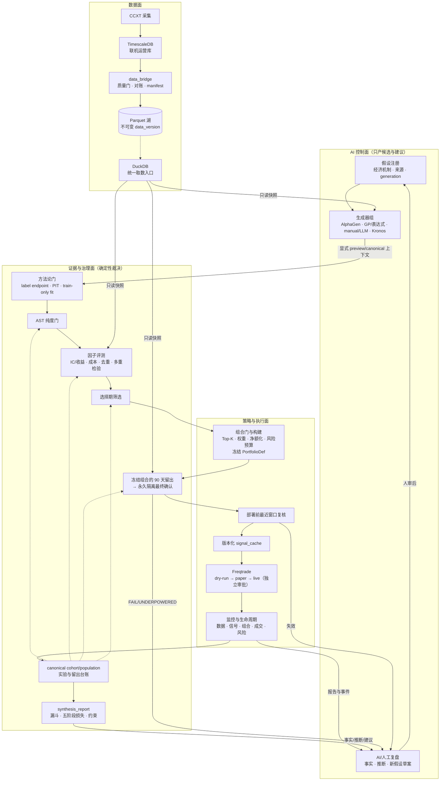
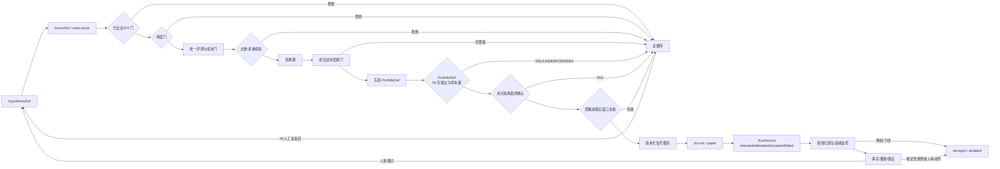
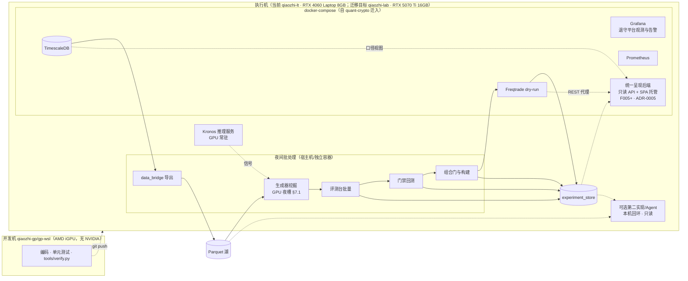

# AlphaMill — 系统架构设计

> 版本：v0.1 | 日期：2026-09-13 | 配套：[alphamill-prd.md](./alphamill-prd.md)

---

## 〇、存储三件套分工（TimescaleDB / Parquet / DuckDB）

**不是三选一的竞品，是流水线上的三段**：Parquet 是文件格式（箱子），DuckDB 是查询引擎（开箱的手），TimescaleDB 是数据库服务（实时柜台）。

| | TimescaleDB | Parquet 湖 | DuckDB |
|---|---|---|---|
| 本质 | PG 时序扩展（数据库服务） | 列式文件格式（无服务） | 进程内 OLAP 查询引擎 |
| 写入 | ✅ 流式写入、幂等 upsert、可修订 | ❌ 不可变，只增新文件 | ❌ 不负责存储 |
| 擅长 | 实时最新值、连续聚合、Grafana 直连 | 大范围列扫描、快照不可变=可复现 | 直接对 Parquet 跑 SQL |
| 复现性 | ❌ 数据会被回补/修订 | ✅ 同一 data_version 永远同结果 | 无关（读的人） |
| 角色 | **联机运营库** | **研究快照**（封存账本） | **取数入口**（会计的手） |

```text
CCXT 采集 ──写入──▶ TimescaleDB（联机运营库，随时改）
                        │  data_bridge：导出不可变快照 + manifest
                        ▼
                    Parquet 湖（封存账本：贴版本封条，只读）
                        ▲  SQL 查询
                    DuckDB（会计：翻箱查账的手）
```

---

## 一、总体架构与职责边界

AlphaMill 按四个平面组织。AI 控制面提出候选和建议，证据与治理面独立裁决并持有实验
台账，策略与执行面负责组合构建与已批准策略的版本化执行，数据面提供可复现输入。外部
工具必须接在稳定契约之后，不能成为跨层捷径。

四平面之上有两条**横向 seam**，不增加新的平面：`Evidence Boundary` 约束 preview/canonical、
实验身份、方法论与晋级；`Lifecycle Feedback` 把运行事实、结构化归因、人审动作和下一代假设
串成闭环。跨 cohort 的 `synthesis_report` 归证据与治理面，控制台只是它的只读渲染器。

```text
┌─ AI 控制面 ───────────────────────────────────────────────────────────────┐
│ 假设注册 → 多生成器/协同池 → 失败与线上归因 → 人审的新假设队列          │
│ 只产候选和建议；无门禁裁决权、生产状态写权限或下单权                     │
└──────────────┬───────────────────────────────────────────────▲────────────┘
               │ HypothesisDef / FactorDef                    │ 报告与事件
┌──────────────▼─ 证据与治理面 ─────────────────────────────────────────────┐
│ 因子评测/去重 → 选择期 → 留出 → 最终确认                                 │
│ experiment ledger 串联数据、代码、因子、组合、信号、审批与运行结果       │
└──────────────┬───────────────────────────────────────────────▲────────────┘
               │ 选择期存活因子 / DeploymentCandidate       │ 冻结 PortfolioDef · 成交与绩效
┌──────────────▼─ 策略与执行面 ─────────────────────────────────────────────┐
│ 组合门 → Top-K/权重/净额化/风险预算 → 冻结 PortfolioDef                  │
│ 验证通过与部署前复核后 → 版本化 signal_cache → Freqtrade                │
│ → dry-run → paper → live（独立审批）→ 风控、监控与生命周期动作           │
└──────────────┬───────────────────────────────────────────────▲────────────┘
               │ 只读研究快照 / 联机行情                    │ 运营日志
┌──────────────▼─ 数据面 ───────────────────────────────────────────────────┐
│ CCXT → TimescaleDB 联机运营库 → data_bridge → 不可变 Parquet 快照         │
│                                    ▲ DuckDB：挖掘/评测/回测统一取数入口    │
└───────────────────────────────────────────────────────────────────────────┘
```

闭环主循环是：数据快照 → 假设与因子 → 证据评测 → 组合与策略 → 交易执行 →
监控归因 → 人审后的新假设。Vibe-Trading 可提供第二意见或 Agent 能力，AlphaGen 可提供因子，
Freqtrade 提供执行；三者都不是闭环本身。

---

## 二、Mermaid 架构图

### 2.1 闭环架构（模块级）



### 2.2 Alpha 生命周期数据流



部署前再验证用于防止部署时滞与衰减错配：最终确认通过不等于当前仍有效。champion 在挂载前
必须用晚于留出窗的最近 30 天窗口复核；challenger 替换 champion 时触发同一流程；上线后
持续监控 IC、成本后收益、组合贡献和执行偏差，超限则降权或下线。正控制可以验证技术闭环，
但不进入可信 Alpha 判定。

---

## 三、模块与目录设计

**单一 Python 布局 = `src/alphamill/<module>/`**（src-layout 已由 pyproject `[tool.hatch.build.targets.wheel] packages = ["src/alphamill"]` 固化）。概念模块名作为子包名：`alphamill/data_bridge`、`alphamill/factor_factory`、`alphamill/validation`、`alphamill/kronos_service` 等；非 Python 资产（docker-compose、`deployment/` 运维脚本、`docs/`）留在仓库根，不进包。全文档所有"平铺目录"（`data_bridge/`、`factor_factory/`…）表述一律指该布局。

```text
alphamill/                       # 仓库根（非 Python 资产留根，不进包）
├── docs/                        # 本文档集
├── deployment/                  # docker-compose / .env 模板 / verify 脚本
├── monitoring/                  # Grafana/Prometheus 配置（自 quant-crypto 迁入）
├── db/                          # 口径唯一居所（ADR-0005）：init.sql + migrations/ 版本化 SQL 视图；
│                                #   应用账本与 runner 见 tools/apply_migrations.py（schema_migrations）
├── web/                         # 自建前端 SPA（ADR-0005）：构建产物由 api 服务静态托管，生产运行时无 Node
├── scripts/                     # 实验运行器、报告生成、verify 脚本（薄入口）
├── reports/                     # 实验 manifest + 归档报告（运行产物）
└── src/alphamill/               # 唯一 Python 包
    ├── data_bridge/             # FR1：TimescaleDB → Parquet + manifest
    │   ├── export_ohlcv.py
    │   ├── export_derivatives.py
    │   └── manifest_schema.json
    ├── factor_factory/          # FR2：假设、生成器与因子注册
    │   ├── hypotheses/          # HypothesisDef 注册、人审队列与 generation
    │   ├── generators/          # FR2.2：可插拔生成器
    │   │   ├── base.py          #   生成器接口：produce() -> list[FactorDef]
    │   │   ├── alphagen_adapter.py  # 表达式树/张量 ↔ FactorDef 适配层（§4.1.1；放 vendor 外，见集成文档卫生规则）
    │   │   ├── alphagen_vendor/ #   AlphaGen 核心 vendor（选型与对接策略见 ADR-0001、alphamill-research-factor-mining.md）
    │   │   ├── genetic/         #   遗传规划（选型见 ADR-0001、alphamill-research-factor-mining.md）
    │   │   ├── expression/      #   表达式枚举
    │   │   └── manual/          #   论文因子/假设清单（人工+LLM 辅助）
    │   ├── bench/               # FR3.1：统一评测台（泛化 kronos_rankic_eval）
    │   │   ├── ic_eval.py       #   RankIC / IC 衰减 / 分状态
    │   │   ├── quantile.py      #   分位数分组收益
    │   │   ├── dedup.py         #   IC 相关性查重
    │   │   ├── cost_filter.py   #   成本硬过滤（taker 费 + 滑点 + 资金费率，§4.2）
    │   │   └── multipletest.py  #   多重检验校正
    │   └── registry/            # FR2.5：因子注册表（sqlite/parquet）
    ├── validation/              # FR3：从 quant-crypto 迁移 + 参数化
    │   ├── methodology_gate.py #   label endpoint/PIT/最大 horizon/train-only fit 静态与运行时门
    │   ├── selection_gate.py
    │   ├── holdout_gate.py      #   样本量三级裁决：<30 UNDERPOWERED / 30~69 临时 PASS / ≥69 可信（PRD FR3.5）
    │   └── no_lookahead_audit.py
    ├── portfolio/               # FR4：组合门、Top-K、权重、净额化与风险预算
    │   ├── contribution.py
    │   ├── builder.py
    │   └── constraints.py
    ├── signal_cache/            # FR5.1：feather 输出契约
    │   └── writer.py            #   兼容 kronos_cache schema
    ├── freqtrade_bridge/        # FR5.3：策略模板 + 配置生成
    │   ├── strategy_template.py.j2
    │   └── risk/                #   风控三件套（自 quant-crypto 迁入）
    ├── experiment_store/        # FR7：内容身份、manifest、证据索引与 append-only 台账
    │   ├── research_snapshot.py #   ADR-0007：dataset versions/digests + cutoff/映射/日历 → snapshot_id
    │   ├── identity.py          #   规范化语义输入 → experiment_id；provenance 不入身份
    │   ├── population.py        #   preview 隔离；canonical cohort/official population 单写边界
    │   └── synthesis.py         #   canonical ledger + 曲线侧车 → synthesis_report
    ├── lifecycle/               # FR6：监控事件、归因与状态动作
    ├── api/                     # 统一人类界面后端（ADR-0005）：领域只读端点；F006 写路径唯一入口与审计咽喉
    ├── kronos_service/          # Kronos 推理服务薄壳（自 quant-crypto 迁入）
    └── vibe_bridge/             # FR3.7/FR6.4：可选第二实现与 Agent 适配器
        ├── local_loader_config/ #   local loader 指向 Parquet 湖
        └── postmortem/          #   agent 复盘工作流（prompt + manifest 收集）
```

---

## 四、关键接口契约

### 4.0 闭环核心对象

```text
ResearchSnapshot + HypothesisDef → FactorDef → factor ExperimentRun
FactorDef(s) → PortfolioDef → portfolio ExperimentRun → DeploymentCandidate
→ DeploymentRun → RunRecord → AttributionReport →（人审通过）新 HypothesisDef
```

- `HypothesisDef` 拥有经济动机、来源、generation、数据依赖、预期持有期和成本敏感性；
- `FactorDef` 拥有可执行定义和版本，不承载评测结论；
- `PortfolioDef` 拥有成员、权重、估计窗口、约束和组合门报告；
- `ExperimentRun` 拥有显式 execution tier、cohort、冻结规则和内容寻址 ID；
- `DeploymentRun` 固定引用 portfolio、信号缓存和审批版本；
- `RunRecord` 保存 intended/attempted/accepted/failed 四桶及执行事实；
- `AttributionReport` 区分事实、推断与建议，经规则或人审才触发生命周期/新假设动作；
- `ExperimentManifest` 是各对象和所有证据之间的不可变索引，不把结果复制回定义对象。

### 4.1 因子定义（FactorDef）

```python
@dataclass(frozen=True)
class FactorDef:
    factor_id: str            # 如 "alphagen_gen042_f003"
    hypothesis_id: str        # 指向 HypothesisDef；自动公式可指向 mechanism_unknown 假设
    name: str
    generator: str            # alphagen / genetic / expression / manual / kronos / pool（协同池 meta-factor）
    scope: Literal["time_series", "cross_sectional"]
    params: dict
    # 可调用：输入单 pair Frame 或 point-in-time 多 pair PanelFrame，输出同粒度信号；
    # t 时刻值只允许使用 ≤t 的数据和 t 时刻真实可用的宇宙成员。
    compute: Callable[[FactorInput], FactorOutput]
    data_columns: list[str]   # 依赖的数据列（用于数据可用性检查）
    meta: dict                # LaTeX 定义、假设来源、生成器版本等
```

**协同池 meta-factor 也是 `FactorDef`**（`generator="pool"`，`scope="cross_sectional"`）：成员
`factor_id` 与权重放在 `params`/`meta`，`compute` 由成员 `FactorDef` 与权重重算，加载即可执行；
成员集合或权重变化产生新 `factor_id`，不原地改写（契约详见 F003 FR-007 / DR-004）。

`expression` **不进入可执行对象顶层**：表达式原文由磁盘 DTO 保存，加载时写入 `meta["expression"]`
（见 F003 design §3「expression 的唯一形态」）。

#### 4.1.1 AlphaGen 适配契约（表达式树/张量世界 ↔ FactorDef pandas 世界）

FactorDef 同时承载单 pair 时序和多 pair 横截面契约；主引擎 AlphaGen 使用表达式树与 GPU 张量。
两个世界通过 `factor_factory/generators/alphagen_adapter.py` 显式衔接：

| 适配方向 | 契约 |
|---|---|
| 表达式树 ↔ callable | AlphaGen 产出的表达式 token 序列由适配层编译为闭包，包装成标准 `FactorDef.compute`（`generator="alphagen"`）；表达式原文写入 `meta["expression"]`，保证可反解与复现 |
| 张量面板 ↔ Frame | `time_series` 输入单 pair Frame；`cross_sectional` 输入带 point-in-time 宇宙掩码的（时间 × pair × 特征）面板。两者输出均显式携带 timestamp/pair 索引 |
| data_columns ↔ 张量特征列 | 适配层维护显式映射 `feature_map: {数据列名 → 张量通道}`（AlphaGen 特征即具名列，funding/OI/basis 作为额外通道进入）；`FactorDef.data_columns` 由表达式引用的特征经 feature_map 反解生成，数据可用性检查语义不变 |

**截面边界**：横截面 rank、标准化和去均值只允许在同一 timestamp 的 point-in-time 宇宙内
计算，不得使用当前成员表回填历史。缺少宇宙成员快照或 pair 在该时点不可交易时，结果为
no-signal；任何隐式全样本统计直接被纯度门拒绝。

### 4.2 统一评测台输入输出

```text
输入：FactorDef 或冻结的 PortfolioDef + 数据窗口（窗口由门禁配置决定，评测台不感知）
成本进选择回路：taker 费 + 滑点为硬过滤字段（cost.hard_filter=true）；资金费率按永续 8h 结算计入持有成本
输出 report.json：
{
  "experiment_id": "...",
  "execution_tier": "preview | canonical",
  "cohort_id": "...",
  "research_snapshot_id": "snapshot_sha256:...",
  "factor_id": "...",
  "rank_ic": {"mean": , "std": , "icir": , "positive_ratio": },
  "ic_decay": {"horizons": [1,2,4,12,24], "values": [...]},
  "by_regime": {"trend": {...}, "range": {...}, "high_vol": {...}},
  "quantile_returns": {"q1": , ..., "q5": , "long_short": },
  "dedup": {"max_ic_corr_with_existing": , "duplicate_of": null},
  "cost": {
    "taker_fee": ,        # 硬过滤字段
    "slippage": ,         # 硬过滤字段
    "funding_drag": {"settlement_hours": 8, "annualized_drag": },
    "long_short_net":     # 成本后 long_short 收益
  },
  "cost_model_version": "cm-v1",   # 与 research_snapshot_id 并列进入 FR7 manifest
  "trade_log_summary": {           # 每候选毛交易日志的等效摘要，用于重定价
    "n_trades": ,
    "gross_return_per_trade": {"p50": , "mean": },
    "turnover": ,                  # 周期换手率
    "holding_period_hours": {"p50": , "p90": }
  },
  "cost_verdict": "cost_ok | cost_negative",
  "failure": {"stage": null, "owner": null, "mechanism": null},
  "verdict": "promising | weak | dead | underpowered | incomplete"
}
```

成本裁决规则：`cost_verdict = "cost_negative"` 时，无论 `rank_ic` 多高，`verdict` 一律直接判
`dead`（PRD FR3.2）。交易费、滑点或资金费率任一项使成本后收益不为正，都不允许候选以
`promising` 或 `weak` 身份流入门禁。成本参数由 dry-run 实际成交校准。

这里的 `verdict` 是成员诊断标签，不是可晋级裁决。canonical cohort 的全部承诺成员登记后，
F007 才统一计算 cohort 级校正并生成 `cohort_verdict.json`；只有其中的 `promotion_verdict`
可以进入后续门禁，未 finalize 的 cohort 不得晋级。

**重定价缓存义务（trade_log_summary）**：评测台不得只存 pass/fail。成本模型变化时，凭逐笔
毛收益或等效摘要重定价，不重新运行生成器；`cost_model_version` 与 `research_snapshot_id` 并列进入
experiment manifest（FR7.1）。

**曲线级时间序列侧车（ADR-0005 呈现契约）**：评测台除标量结论外必须持久化曲线级时间序列，
供研究控制台渲染（以 F007 spec 为准，先于 F005 开发锁定）：

- 路径：与评测报告同目录写 `curves.parquet`
  （`reports/bench/<object_id>/<research_snapshot_id>/<experiment_id>/curves.parquet`，报告根 `reports/`
  见 §三 目录树），
  与 `report.json` 在同一原子批次发布；
- manifest 关联键：experiment manifest 增 `curves: {path, rows, columns, sha256}`，与报告、
  `research_snapshot_id`、`cost_model_version` 并列，保证曲线可从真相源确定性重放；
- 最小列集：`equity_after_cost`（成本后累计权益）、`drawdown`（回撤）、
  `q1_cum`..`q5_cum`、`long_short_cum`（分位数/多空累计收益，按 bar 时间展开）、
  `rolling_ic_h1/h2/h4/h12/h24`（各 horizon 的滚动 IC）；时间轴为逐日/逐 bar UTC 时间戳。
  `report.json` 的 `quantile_returns`/`ic_decay` 是全样本标量汇总，侧车是其时间展开，
  两者口径必须可互推（如侧车末日累计值对齐标量分组收益）。

**综合报告契约**：F007 从 canonical experiment ledger 与曲线侧车生成不可变
`synthesis_report.json`，至少包含 cohort 漏斗、有效独立数、信号质量/组合转换/成本容量/
时序稳定/执行实现五阶段损失、最大约束，以及分栏的事实/推断/建议。它是证据与治理产物；
F005 不重新计算口径，只渲染该报告。

#### 4.2.1 组合定义与组合门

```python
@dataclass(frozen=True)
class PortfolioDef:
    portfolio_id: str
    members: list[str]             # FactorDef 或 meta-factor ID
    weights: dict[str, float]
    estimation_window: tuple[str, str]
    constraints: dict              # 换手、净敞口、容量、最小订单等
    construction_version: str
```

组合门在选择期另产出 `portfolio_report.json`，至少包含边际成本后收益、边际回撤、与现有组合
相关性、容量、换手和约束违例。协同池成员选择、Top-K、权重和阈值只允许使用选择期及更早
数据；PortfolioDef 随后冻结并以整体进入留出和最终确认。看过门禁结果后的任何修改都会生成
新 ID，并从头消耗门禁预算。

### 4.3 信号缓存契约（与 kronos_cache 兼容）

```text
路径：signal_cache/<portfolio_or_factor_id>/<research_snapshot_id>/<code_version+params_hash>/<pair>/<YYYY-MM-DD>.feather
列：  timestamp(信号确认时刻, UTC), pair, signal_value, confidence*, stale
约束：t 行只含 ≤t 信息；留出门审计按行校验时间戳对齐
```

三条补充规则（与集成文档 §3.2 无前视对齐规则配套）：

1. **缓存键带版本维度**：缓存键 = (portfolio_or_factor_id, research_snapshot_id, code_version,
   params_hash, pair)，不是仅 timestamp+pair。任一输入 dataset 修订或代码/参数变化后写新版本目录，旧版本
   只读不覆盖。
2. **混合频率陈旧策略**（4h 因子进 1h 决策）：merge_asof（backward）对齐后允许前向填充，但仅在最大陈旧度界内——因子值有效至下一个因子 K 线收盘，硬过期 = N 根决策 K 线（默认 N = 1 个因子周期，4h→1h 即 N=4）。越过界的行 `signal_value` 写 NaN（no-signal 语义），**不得当旧信号继续使用**；`stale` 列记录该行相对因子 K 线收盘的滞后根数，供审计核对。
3. **审计覆盖 join 步骤**：无前视审计的范围显式包含 merge/join 步骤本身，不只因子计算——逐 K 线重放时对每个决策 bar 校验（信号时间戳 ≤ t 收盘）∧（陈旧度 ≤ 界），两项任一不满足即审计失败。

### 4.4 DatasetVersion manifest

```json
{
  "dataset": "ohlcv_1m",
  "source": "timescaledb@quant-crypto",
  "exported_at": "2026-09-06T03:00:00Z",
  "rows": 6318000,
  "pairs": ["BTC-USDT-SWAP", "..."],
  "caliber": {"close": "raw", "adjclose": "none_crypto"},
  "data_version": "v2026.09.06",
  "value_digest": "sha256:...",
  "quality_flags_resolved": 0
}
```

DatasetVersion 按 dataset 独立演进，稳定引用是 `(dataset, data_version, value_digest)`；
`value_digest` 是由 dataset 投影 schema 与按逻辑键排序的分区 `(rows, time bounds, row_digest)`
计算的语义根摘要，不包含物理路径、codec、文件 SHA 或导出时间；具体规范以 F002 design §3 为准。
`exported_at` 只描述写出 provenance。单 dataset reader 可以为探索解析 latest valid，但任何正式
多数据集研究都必须先按 ADR-0007 冻结 ResearchSnapshot，不能把多个 latest 或 exported_at
临时聚合当作可复现实验输入。

#### 4.4.1 ResearchSnapshot

```json
{
  "schema_version": 1,
  "snapshot_id": "snapshot_sha256:...",
  "cutoff_time": "2026-09-06T00:00:00Z",
  "members": {
    "ohlcv_1m": {"data_version": "v2026.09.06", "value_digest": "sha256:...", "as_of_fidelity": "event_time_only", "event_time_min": "...", "event_time_max": "..."},
    "funding": {"data_version": "v2026.09.06-r2", "value_digest": "sha256:...", "as_of_fidelity": "bitemporal", "event_time_min": "...", "event_time_max": "..."}
  },
  "symbol_map_digest": "sha256:...",
  "universe_calendar_digest": "sha256:..."
}
```

ResearchSnapshot 位于 `reports/research_snapshots/<snapshot_id>/manifest.json`，只引用 lake manifests，
不复制 Parquet，也不突破研究只读 lake 红线。构造器归 `experiment_store`：成员缺失/invalid、
value digest 或覆盖范围不符、as-of 保真度不足、映射/日历摘要缺失均失败关闭。preview 请求
latest 时也必须先发布该对象；canonical 只接受既有 snapshot ID。symbol map 由 F002 内容寻址
保存于 `lake/_metadata/symbol_maps/<digest>.csv`；显式 universe/calendar JSON 由构造器规范化后保存于
`reports/research_snapshots/_inputs/universe_calendars/<digest>.json`，二者均可按 snapshot provenance
重放，current 文件或调用方原路径不充当证据。

### 4.5 实验身份与执行上下文

```text
ExperimentContext = {
  execution_tier: preview | canonical,
  upstream_object_id,
  cohort_id,
  normalized_method_config,
  research_snapshot_id,
  code_build_digest,
  seed,
  supersedes?
}

experiment_id = digest(upstream_object_id, cohort_id, normalized_method_config,
                       research_snapshot_id, code_build_digest, seed)
provenance = {artifact_path, file_sha256, codec, created_at, host, duration}
```

`execution_tier` 必须由调用方显式构造并沿调用链传递，不读取环境变量或进程全局默认值。
它与 `supersedes` 不参与 `experiment_id`：前者由命名空间/capability 强制，后者只是谱系关系；
preview 与 canonical 使用隔离命名空间；preview 不得写 official population、留出访问台账或
晋级结论。canonical 在执行前冻结 cohort、选择阶段、窗口和规则版本，并用幂等键保证同一
语义运行只登记一次。cohort 成员全部完成不可变登记并统一计算 cohort 级校正后才可晋级；
语义输入变化时生成新 ID，以 `supersedes` 关联旧版本，历史产物不覆盖。

ResearchSnapshot 按 ADR-0007 绑定 F002 dataset manifests 与 canonical rows/value digests；
Parquet 文件 SHA-256 只验证物理文件完整性，不因压缩编码差异改变实验身份。必需指标计算失败、
snapshot/输入摘要不一致或方法论/parity
检查跳过时，运行只能进入 `INCOMPLETE/FAIL`，不能晋级。

---

## 五、quant-crypto 资产清算迁移表

> 逐项操作步骤与验收标准见 [F001 migration-plan](features/0.1/F001-quant-crypto-migration/migration-plan.md)。

| quant-crypto 资产 | AlphaMill 处置 |
|---|---|
| TimescaleDB 湖 + 质量标记 | **迁入本仓**，新增导出桥（FR1） |
| `kronos_rankic_eval.py` / `kronos_ic_decay_eval.py` | **泛化为统一评测台**（FR3.1），Kronos 信号作为第一批入库因子 |
| `independent_cross_backtest.py`（独立重放器） | **迁入**为无前视审计器（FR3.6） |
| `validate_low_frequency_*_holdout.py` 门禁脚本 | **参数化迁移**到 `src/alphamill/validation/`，落实 FR3.4/FR3.5 |
| 风控三件套 + Freqtrade dry-run | **迁入**（FR5），策略模板化 |
| Grafana / Prometheus / 日报 | **迁入**；实验谱系与评测浏览归自建研究控制台（ADR-0005），Grafana 逐步退守平台观测与告警 |
| Kronos 信号服务 + 缓存 | 薄壳迁入 `src/alphamill/kronos_service/`；模型代码上游 clone + pin |
| `discover_okx_swap_universe.py` | **复用**做宇宙扩容到 30~50 对（FR1.5） |

---

## 六、可选研究与 Agent 适配器

Vibe-Trading 是 FR3.7 第二实现复核和 FR6.4 AI 复盘的一种可替换提供者，限时接入且不进入
主链路。不可用时，第二意见退化为本仓独立重放器或手工第二实现，复盘退化为其他只读 Agent
适配器；两者都不改变门禁结论。

| 面 | 用途 | 对接方式 |
|---|---|---|
| `local` loader | 第二意见回测读 Parquet 湖 | `source: "local"`，`local:` 前缀禁止静默回退网络源 |
| 回测/验证工具 | MC 置换 / Bootstrap Sharpe CI / Walk-Forward 独立复核 | CLI `vibe-trading run` + REST |
| `quantlib_call` | 多重检验校正（deflated significance）、purged CV、绩效归因 | MCP/CLI 只读调用 |
| Agent | 失败归因复盘、论文→因子提取（SDM 模式参照）、新假设生成 | 本机运行，读 AlphaMill 的 manifest/报告目录 |

**明确不接**：实盘交易栈、行情数据源、MCP 写类工具、门禁裁决和生命周期状态写入。

---

## 七、部署拓扑



节奏：白天 Freqtrade dry-run/paper 与监控在线；夜间跑「导出 → 挖掘 → 评测 → 门禁 →
组合构建」批处理。人工审查晋级、部署和复盘产生的新假设（白天经统一呈现后端浏览批处理
产出，研究控制台先行，ADR-0005；Grafana 逐步退守平台观测与告警）。GPU 占用按时段表调度（见 7.1）。

### 7.1 机器边界与单卡 GPU 时段调度

**两类机器，职责不重叠**（事实源：env-manager `data/fleet.json`）：

| 角色 | 主机 | 平台与 GPU | 职责 |
|---|---|---|---|
| 开发机 | `qiaozhi-gp` / `gp-wsl` | Legion Go，AMD Ryzen Z2 + Radeon 780M iGPU（**无 NVIDIA**），Win11 + WSL2 Ubuntu 26.04 | 编码、单元测试、`python3 tools/verify.py` 门禁；不承载 GPU 负载，不作为集成/性能证据来源 |
| 执行机（当前） | `qiaozhi-lt` | Windows 11 笔记本 + WSL2，RTX 4060 Laptop 8GB | 全部联机运营与批处理：TimescaleDB + 采集 + 导出 + Parquet 湖 + dry-run + 监控 + Kronos 常驻 + 挖掘训练 + 评测门禁 |
| 执行机（最终） | `qiaozhi-lab` | **原生 Ubuntu 26.04**（与 Windows 侧 `qiaozhi-ws` 双系统互斥），Intel Ultra 7 265K 20 核 / 45GB RAM / 1.1TB `/data`，RTX 5070 Ti 16GB（Blackwell sm_120），CUDA 13.1/13.2 | 迁移完成后接管上述全部职责 |

**执行机迁移路线**：先在 `qiaozhi-lt` 上把全链路跑通跑熟，成熟后**整体迁移**到 `qiaozhi-lab`。迁移是一次性搬迁，不是双机并行——同一时刻只有一台执行机在跑。注意这不只是换卡：

- **平台变了**：Windows 11 + WSL2 → 原生 Ubuntu，docker 编排、路径、开机自启、备份通道都要重新落地；
- **架构变了**：Blackwell sm_120 需要 CUDA 12.8+ 的 torch 构建，默认 wheel 不一定含该架构，依赖 pin 必须显式选择；
- **预算变了**：显存 8GB → 16GB，本节 VRAM 预算与时段表必须**重新标定**，"训练窗口内卸载 Kronos"等约束可能放宽，但放宽须经一次显式重标，不得默认继承。

迁移后重跑一遍全链路验收（迁移动作本身按独立 Feature 立项）。

**单卡 GPU 时段调度（当前执行机 `qiaozhi-lt`，RTX 4060 Laptop 8GB）**

三个 GPU 负载（Kronos 常驻推理 / AlphaGen 夜间训练 / Vibe MC）共用一张卡，采用**时段表 + 单槽队列**，不做 OOM 赌博：

| 时段 | 负载 | VRAM 预算 | 说明 |
|---|---|---|---|
| 白天 07:00–22:00 | Kronos 常驻推理 | ≤3GB | 服务常驻，供 dry-run 信号 |
| 工作日夜 22:00–06:30 | AlphaGen 训练（挖掘一代） | ≤6GB 独占 | 训练窗口内 Kronos 卸载，dry-run 读 signal_cache 存量信号、不实时推理；data_bridge 导出与训练串行 |
| 周末白天 | 可选第二实现（置换/Bootstrap） | ≤2GB | 与 Kronos 常驻共存（3+2 ≤ 8GB），仅在需要时复核 |
| 任意 | 碰撞规则：单槽 FIFO 队列 | — | 时段表之外或与在跑任务撞车的任务一律排队，**队列赢，绝不并行赌 OOM** |

VRAM 预算为硬上限：任务启动前自检可用显存，低于预算即进队列等待，不允许挤占时段或互相抢卡。预算值与时段表随执行机走，迁移后按上文重标。

**Kronos 服务生命周期契约（版本化，供夜槽编排消费）**：`kronos-signal` 的服务端暴露版本化控制面
（`contract_version`），供挖掘编排在训练窗口边界调用：

| 动作 | 语义 | 幂等性 | 超时 | 错误码 |
|---|---|---|---|---|
| `status` | 返回 `{state: running\|stopped, contract_version, model_loaded, vram_bytes}` | 只读，天然幂等 | 可配（默认 5s） | `E_UNAVAILABLE` |
| `stop` | 优雅停止推理并释放显存，返回释放后的 `vram_bytes` | 重复调用返回 `state=stopped`，不报错 | 可配（默认 60s） | `E_BUSY` / `E_TIMEOUT` / `E_UNSUPPORTED_VERSION` |
| `restore` | 恢复常驻推理，返回 `state=running` | 重复调用返回 `state=running` | 可配（默认 120s） | `E_BUSY` / `E_TIMEOUT` / `E_UNSUPPORTED_VERSION` |

- **wire 绑定**：控制面经 HTTP 暴露——`GET /lifecycle/status`、`POST /lifecycle/stop`、
  `POST /lifecycle/restore`（JSON）；所有请求必须带 `X-Contract-Version` 头（当前 `1`），
  服务端不支持该版本时返回 `E_UNSUPPORTED_VERSION`；错误响应统一信封 `{"error": "E_*"}`。
  客户端可见行为由契约测试 `tests/integration/test_f003_kronos_lifecycle.py` 锁定；
- **显存确认**：`stop` 之后编排必须经 `status` 的 `vram_bytes` 或设备侧读数确认显存已释放，
  未确认不得取锁训练；
- **契约版本**：`contract_version` 不匹配（`E_UNSUPPORTED_VERSION`）视为服务端未实现该契约；
- **未部署与失败语义**：控制面不可达且该服务确实未部署 → 编排记 `offload_not_needed` 并继续；
  服务在跑却返回忙碌/超时 → **fail-closed**：任务留在单槽队列，绝不与常驻推理并行抢卡；
- **所有权**：契约正文由本节拥有；客户端调用与运行取证归 F003（训练窗口编排），服务端实现归
  `kronos-signal` 交付。
