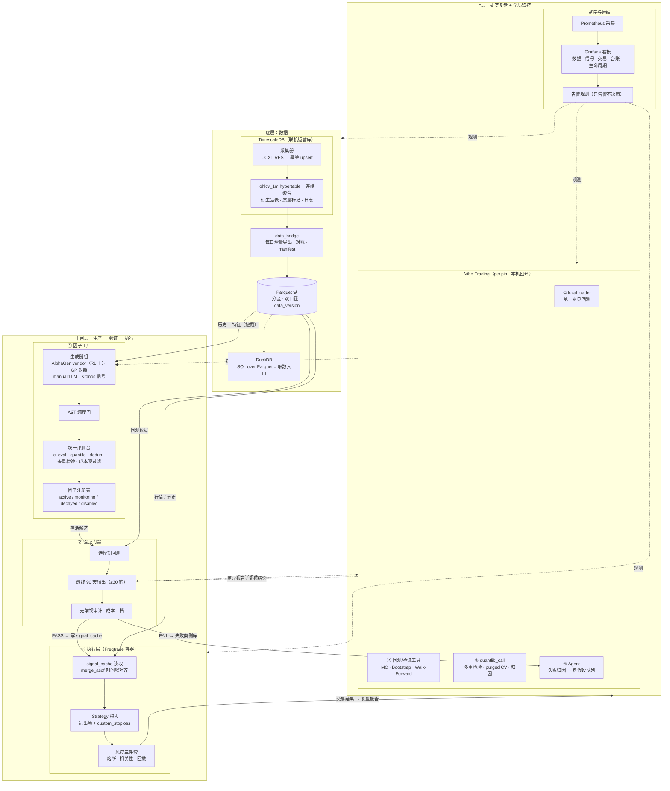
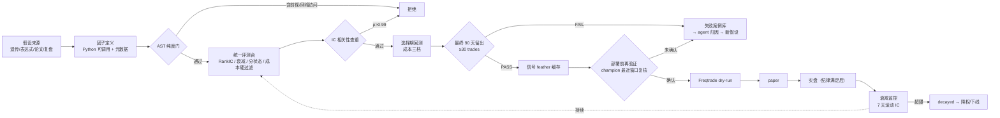
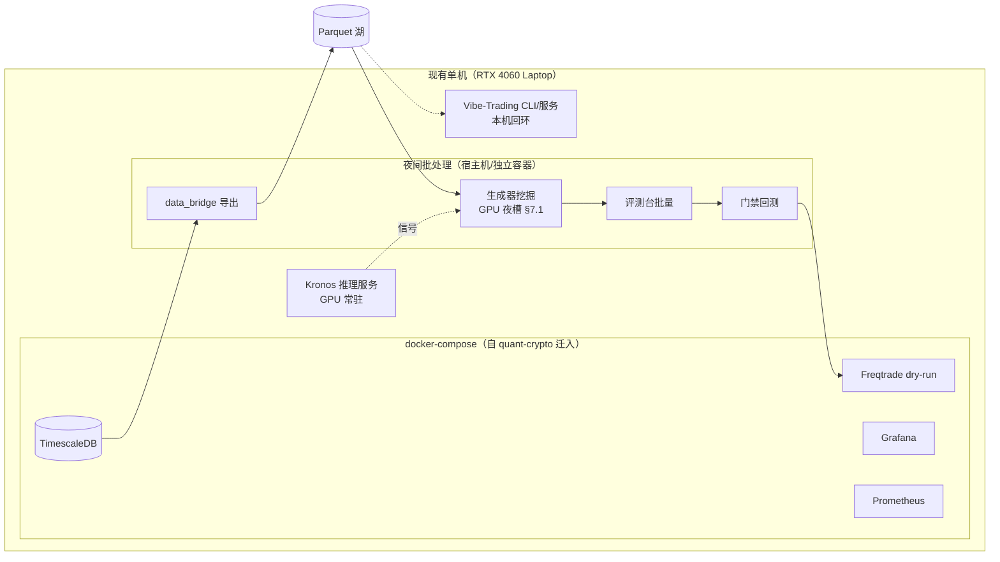

# AlphaMill — 系统架构设计

> 版本：v0.4 | 日期：2026-09-07 | 配套：[alphamill-prd.md](./alphamill-prd.md)
> v0.4 变更：目录设计统一为 src-layout（`src/alphamill/<module>/`）；§4.1 增 AlphaGen 适配契约；§4.2 评测台增成本硬过滤与资金费率成本项；§4.3 信号缓存增版本键/陈旧度/审计覆盖三规则；§2.2 生命周期增部署前再验证；§七 增单卡 GPU 时段调度。
> v0.3 变更：三层骨架内各层细化到模块级；新增「存储三件套分工」（TimescaleDB / Parquet / DuckDB）。
> v0.2 变更：按标准分层重画（数据最下、生产/验证/执行居中、研究复盘与监控最上），明确闭环主循环。

---

## 〇、存储三件套分工（TimescaleDB / Parquet / DuckDB）

**不是三选一的竞品，是流水线上的三段**：Parquet 是文件格式（箱子），DuckDB 是查询引擎（开箱的手），TimescaleDB 是数据库服务（实时柜台）。

| | TimescaleDB | Parquet 湖 | DuckDB |
|---|---|---|---|
| 本质 | PG 时序扩展（数据库服务） | 列式文件格式（无服务） | 进程内 OLAP 查询引擎 |
| 写入 | ✅ 流式写入、幂等 upsert、可修订 | ❌ 不可变，只增新文件 | ❌ 不负责存储 |
| 擅长 | 实时最新值、连续聚合、Grafana 直连 | 大范围列扫描、快照不可变=可复现 | 直接对 Parquet 跑 SQL |
| 复现性 | ❌ 数据会被回补/修订 | ✅ 同一 data_version 永远同结果 | 无关（读的人） |
| 角色 | **联机运营库** | **研究快照**（封存账本） | **取数入口**（会计的手） |

```text
CCXT 采集 ──写入──▶ TimescaleDB（联机运营库，随时改）
                        │  data_bridge：导出不可变快照 + manifest
                        ▼
                    Parquet 湖（封存账本：贴版本封条，只读）
                        ▲  SQL 查询
                    DuckDB（会计：翻箱查账的手）
```

---

## 一、总体架构（分层 · 模块级）

```text
┌────────────────────────────────────────────────────────────────────────────┐
│ 上层：研究复盘 + 全局监控                                                   │
│                                                                             │
│  ┌─ Vibe-Trading（pip pin · 本机回环）─────────────────────────────────┐   │
│  │ ① local loader  读 Parquet 湖做第二意见回测（禁止回退网络源）        │   │
│  │ ② 回测/验证工具  MC 置换 · Bootstrap Sharpe CI · Walk-Forward        │   │
│  │ ③ quantlib_call  多重检验校正 · purged CV · 绩效归因（只读）          │   │
│  │ ④ Agent          失败归因 → 新假设队列 · 论文→因子（SDM 模式）        │   │
│  └──────────────────────────────────────────────────────────────────────┘   │
│  ┌─ 监控与运维 ─────────────────────────────────────────────────────────┐   │
│  │ Prometheus(采集) → Grafana(看板) → 告警规则（只告警不决策）           │   │
│  │ 看板：数据延迟/缺失 · 信号质量(60m回填+7d滚动IC)                      │   │
│  │       交易健康(PnL/回撤/熔断) · 实验台账 · 因子生命周期               │   │
│  └──────────────────────────────────────────────────────────────────────┘   │
└─────────▲服务调用（回测/复盘）────▲观测三层（无写路径）─────────────────────┘
          │
┌─────────┴───────────────────────────────────────────────────────────────────┐
│ 中间层：生产 → 验证 → 执行                                                  │
│                                                                             │
│  ┌─ ① 因子工厂 ─────────────────────────────────────────────────────────┐  │
│  │ 生成器组：[AlphaGen vendor · RL 主] [GP/表达式对照] [manual/LLM]      │  │
│  │           [Kronos 推理服务 ← GPU 常驻：上游代码+HF权重+本仓薄壳]      │  │
│  │    ↓ 产出 FactorDef                                                   │  │
│  │ AST 纯度门（含前视/网络访问即拒绝）                                    │  │
│  │    ↓                                                                   │  │
│  │ 统一评测台：ic_eval(RankIC/衰减/分状态) · quantile · dedup · 多重检验  │  │
│  │    ↓ 存活者                                                            │  │
│  │ 因子注册表：元数据 + 生命周期 active/monitoring/decayed/disabled      │  │
│  └───────────────────────────────────────────────────────────────────────┘  │
│  ┌─ ② 验证门禁 ──────────────────────────────────────────────────────────┐  │
│  │ 选择期回测 → 最终 90 天留出（≥30 笔才可判 PASS/FAIL）                 │  │
│  │   → 无前视审计（独立逐 K 线重放）→ 成本三档（taker/maker/零）          │  │
│  │ PASS → 写 signal_cache    FAIL → 失败案例库（→上层 Agent 归因）        │  │
│  └───────────────────────────────────────────────────────────────────────┘  │
│  ┌─ ③ 执行层（Freqtrade 容器）───────────────────────────────────────────┐  │
│  │ 策略模板读 signal_cache（merge_asof 时间戳对齐，无前视）               │  │
│  │   → IStrategy 进出场 + custom_stoploss                                 │  │
│  │   → 风控三件套（confirm_trade_entry：熔断/相关性/回撤）→ CCXT 下单     │  │
│  │ 渐进：dry-run → paper → 实盘（留出纪律满足后）                         │  │
│  └───────────────────────────────────────────────────────────────────────┘  │
└─────────▲历史+特征（挖掘）────▲回测数据──────────────▲行情/历史─────────────┘
          │
┌─────────┴────────────────────────────────────────────────────────────────────┐
│ 底层：数据                                                                   │
│                                                                              │
│  ┌─ TimescaleDB（联机运营库，自 quant-crypto 迁入）────────────────────┐    │
│  │ 采集器（CCXT REST 轮询 · 幂等 upsert）→ ohlcv_1m hypertable（压缩）  │    │
│  │   → 连续聚合（5m/1h/4h/1d）· 衍生品表（funding/basis/OI）            │    │
│  │   → 质量标记表（ohlcv_quality_flags）· 信号/交易日志                 │    │
│  └──────────────────────────────────────────────────────────────────────┘    │
│         │ data_bridge：每日增量导出 + 每周对账 + manifest（版本封条）         │
│         ▼                                                                     │
│  ┌─ Parquet 湖（不可变研究快照）────────────────────────────────────────┐    │
│  │ 分区：dataset/exchange/pair/date.parquet · 双口径列 · data_version   │    │
│  └──────────────────────────────────────────────────────────────────────┘    │
│         ▲ DuckDB（进程内查询引擎）：SQL over Parquet = 挖掘/评测/门禁取数入口 │
└──────────────────────────────────────────────────────────────────────────────┘

闭环主循环：
数据 → ①工厂挖掘 → 评测台粗筛 → Vibe-Trading 第二意见 → ②留出门 PASS
     → 信号缓存 → ③Freqtrade 交易 → 交易结果 → Vibe-Trading 复盘报告
     → 失败归因/新假设 → 回到 ①工厂（周而复始，监控全程观测告警）
```

---

## 二、Mermaid 架构图

### 2.1 分层架构（模块级）



### 2.2 因子生命周期数据流



部署前再验证（防部署时滞与衰减错配）：留出 PASS ≠ 当下有效——验证到部署之间的时滞内，crypto 因子可能已按周-月级节奏衰减。规则：① **champion 上线前再确认**——dry-run 挂载前，champion 必须在最近窗口（默认最近 30 天，晚于留出窗）重过一次评测台粗筛，未确认不得上线；② **challenger 轮换即再验证触发器**——注册表 champion 被 challenger 顶替时，新 champion 走同一再验证，旧 champion 降级入 monitoring；③ 上线后衰减告警（7 天滚动 IC）继续挂钩降权/下线，与 FR2.3 注册表、FR4.4 生命周期管理对接。

---

## 三、模块与目录设计

**单一 Python 布局 = `src/alphamill/<module>/`**（src-layout 已由 pyproject `[tool.hatch.build.targets.wheel] packages = ["src/alphamill"]` 固化）。概念模块名作为子包名：`alphamill/data_bridge`、`alphamill/factor_factory`、`alphamill/validation`、`alphamill/kronos_service` 等；非 Python 资产（docker-compose、`deployment/` 运维脚本、`docs/`）留在仓库根，不进包。全文档所有"平铺目录"（`data_bridge/`、`factor_factory/`…）表述一律指该布局。

```text
alphamill/                       # 仓库根（非 Python 资产留根，不进包）
├── docs/                        # 本文档集
├── deployment/                  # docker-compose / .env 模板 / verify 脚本
├── monitoring/                  # Grafana/Prometheus 配置（自 quant-crypto 迁入）
├── scripts/                     # 实验运行器、报告生成、verify 脚本（薄入口）
├── reports/                     # 实验 manifest + 归档报告（运行产物）
└── src/alphamill/               # 唯一 Python 包
    ├── data_bridge/             # FR1：TimescaleDB → Parquet + manifest
    │   ├── export_ohlcv.py
    │   ├── export_derivatives.py
    │   └── manifest_schema.json
    ├── factor_factory/
    │   ├── generators/          # FR2.1：可插拔生成器
    │   │   ├── base.py          #   生成器接口：produce() -> list[FactorDef]
    │   │   ├── alphagen_adapter.py  # 表达式树/张量 ↔ FactorDef 适配层（§4.1.1；放 vendor 外，见集成文档卫生规则）
    │   │   ├── alphagen_vendor/ #   AlphaGen 核心 vendor（选型与对接策略见 ADR-0001、alphamill-research-factor-mining.md）
    │   │   ├── genetic/         #   遗传规划（选型见 ADR-0001、alphamill-research-factor-mining.md）
    │   │   ├── expression/      #   表达式枚举
    │   │   └── manual/          #   论文因子/假设清单（人工+LLM 辅助）
    │   ├── bench/               # FR2.2：统一评测台（泛化 kronos_rankic_eval）
    │   │   ├── ic_eval.py       #   RankIC / IC 衰减 / 分状态
    │   │   ├── quantile.py      #   分位数分组收益
    │   │   ├── dedup.py         #   IC 相关性查重
    │   │   ├── cost_filter.py   #   成本硬过滤（taker 费 + 滑点 + 资金费率，§4.2）
    │   │   └── multipletest.py  #   多重检验校正
    │   └── registry/            # FR2.3：因子注册表（sqlite/parquet）
    ├── validation/              # FR3：从 quant-crypto 迁移 + 参数化
    │   ├── selection_gate.py
    │   ├── holdout_gate.py      #   ≥30 trades 判定门槛
    │   └── no_lookahead_audit.py
    ├── signal_cache/            # FR5.1：feather 输出契约
    │   └── writer.py            #   兼容 kronos_cache schema
    ├── freqtrade_bridge/        # FR5.2：策略模板 + 配置生成
    │   ├── strategy_template.py.j2
    │   └── risk/                #   风控三件套（自 quant-crypto 迁入）
    ├── kronos_service/          # Kronos 推理服务薄壳（自 quant-crypto 迁入）
    └── vibe_bridge/             # FR4：Vibe-Trading 接入
        ├── local_loader_config/ #   local loader 指向 Parquet 湖
        └── postmortem/          #   agent 复盘工作流（prompt + manifest 收集）
```

---

## 四、关键接口契约

### 4.1 因子定义（FactorDef）

```python
@dataclass(frozen=True)
class FactorDef:
    factor_id: str            # 如 "alphagen_gen042_f003"
    name: str
    generator: str            # alphagen / genetic / expression / manual / kronos
    params: dict
    # 可调用：输入单 pair 的 OHLCV+衍生品 DataFrame（按时间升序），
    # 输出与 index 对齐的信号 Series（无前视：t 时刻值只允许用 ≤t 的数据）
    compute: Callable[[pd.DataFrame], pd.Series]
    data_columns: list[str]   # 依赖的数据列（用于数据可用性检查）
    meta: dict                # LaTeX 定义、假设来源、生成器版本等
```

#### 4.1.1 AlphaGen 适配契约（表达式树/张量世界 ↔ FactorDef pandas 世界）

FactorDef 的 `compute` 是 pandas 单 pair 契约；主引擎 AlphaGen 是表达式树 + GPU 张量计算器。两个世界通过显式适配层衔接（`factor_factory/generators/alphagen_adapter.py`，置于 vendor 目录之外，遵循集成文档 vendor 卫生规则），这是 M2 的核心设计：

| 适配方向 | 契约 |
|---|---|
| 表达式树 ↔ callable | AlphaGen 产出的表达式 token 序列由适配层编译为闭包，包装成标准 `FactorDef.compute`（`generator="alphagen"`）；表达式原文写入 `meta["expression"]`，保证可反解与复现 |
| 张量面板 ↔ DataFrame | AlphaGen 原生按（特征 × 时间 × pair）张量批量求值；v0.1 适配路径只走**单 pair**：单 pair DataFrame → [n_features, n_steps] 张量 → 表达式求值 → 与 index 对齐输出 Series。多 pair 横截面面板仅用于训练期 reward 计算，**不进** FactorDef 契约 |
| data_columns ↔ 张量特征列 | 适配层维护显式映射 `feature_map: {数据列名 → 张量通道}`（AlphaGen 特征即具名列，funding/OI/basis 作为额外通道进入）；`FactorDef.data_columns` 由表达式引用的特征经 feature_map 反解生成，数据可用性检查语义不变 |

**截面算子边界（v0.1 明确裁剪）**：研究文档 §3.1 的 AlphaGen 算子分类中，"截面"类（Abs/Log/四则/Greater/Less）实为逐元素算子，单 pair 张量内可求值，随 v0.1 契约承载；**跨 pair 真横截面算子（横截面 rank/标准化/去均值类）不在 v0.1 契约范围内**——生成器若产出含此类算子的表达式，适配层拒绝编译，并以 `meta["scope"]="cross_sectional_deferred"` 显式标记送失败案例库，待本契约扩展出多 pair 面板输入路径后再启用。禁止半支持状态静默流入评测台。

### 4.2 统一评测台输入输出

```text
输入：FactorDef + 数据窗口（选择期/留出期由门禁配置决定，评测台不感知）
成本进选择回路：taker 费 + 滑点为硬过滤字段（cost.hard_filter=true）；资金费率按永续 8h 结算计入持有成本
输出 report.json：
{
  "factor_id": "...",
  "rank_ic": {"mean": , "std": , "icir": , "positive_ratio": },
  "ic_decay": {"horizons": [1,2,4,12,24], "values": [...]},
  "by_regime": {"trend": {...}, "range": {...}, "high_vol": {...}},
  "quantile_returns": {"q1": , ..., "q5": , "long_short": },
  "dedup": {"max_ic_corr_with_existing": , "duplicate_of": null},
  "cost": {
    "taker_fee": ,        # 硬过滤字段
    "slippage": ,         # 硬过滤字段
    "funding_drag": {"settlement_hours": 8, "annualized_drag": },
    "long_short_net":     # 成本后 long_short 收益
  },
  "cost_verdict": "cost_ok | cost_negative",
  "verdict": "promising | weak | dead"
}
```

成本裁决规则：`cost_verdict = "cost_negative"` 时，无论 `rank_ic` 多高，`verdict` 一律**直接判 `dead`**（与 PRD FR2.2 硬过滤口径一致）——涵盖两种情形：taker 费 + 滑点成本后收益 ≤0（FR2.2 硬过滤枚举），或资金费率拖累吞掉 IC 收益（FR2.5 持有成本口径）。IC 正但成本负的候选不允许以 `promising` 或 `weak` 身份流入门禁。成本参数来源与校准（dry-run 实测成交）归 FR3.4。

组合与池的数据边界（硬约束，与 ADR-0004 联动）：**协同池构建与 Top-K 选择只允许使用留出窗之前的数据**——池成员增删、池权重拟合、Top-K 入选判定若触碰留出窗内任何数据，组合即获得单因子从未有的事内优势，≥30 笔门槛形同虚设。逆波动率权重的估计窗**显式限定于留出前**；实现上若与门禁窗分离，须在 manifest 中声明估计窗位置（进 FR6.1 台账）。

### 4.3 信号缓存契约（与 kronos_cache 兼容）

```text
路径：signal_cache/<factor_id>/<data_version>/<code_version+params_hash>/<pair>/<YYYY-MM-DD>.feather
列：  timestamp(信号确认时刻, UTC), pair, signal_value, confidence*, stale
约束：t 行只含 ≤t 信息；留出门审计按行校验时间戳对齐
```

三条补充规则（与集成文档 §3.2 无前视对齐规则配套）：

1. **缓存键带版本维度**：缓存键 = (factor_id, data_version, code_version, params_hash, pair)，不是仅 timestamp+pair。数据修订或因子代码/参数变更后写新版本前缀目录，旧版本只读不覆盖——在途回测与复现互不污染。
2. **混合频率陈旧策略**（4h 因子进 1h 决策）：merge_asof（backward）对齐后允许前向填充，但仅在最大陈旧度界内——因子值有效至下一个因子 K 线收盘，硬过期 = N 根决策 K 线（默认 N = 1 个因子周期，4h→1h 即 N=4）。越过界的行 `signal_value` 写 NaN（no-signal 语义），**不得当旧信号继续使用**；`stale` 列记录该行相对因子 K 线收盘的滞后根数，供审计核对。
3. **审计覆盖 join 步骤**：无前视审计的范围显式包含 merge/join 步骤本身，不只因子计算——逐 K 线重放时对每个决策 bar 校验（信号时间戳 ≤ t 收盘）∧（陈旧度 ≤ 界），两项任一不满足即审计失败。

### 4.4 Parquet 湖 manifest

```json
{
  "dataset": "ohlcv_1m",
  "source": "timescaledb@quant-crypto",
  "exported_at": "2026-09-06T03:00:00Z",
  "rows": 6318000,
  "pairs": ["BTC-USDT-SWAP", "..."],
  "caliber": {"close": "raw", "adjclose": "none_crypto"},
  "data_version": "v2026.09.06",
  "quality_flags_resolved": 0
}
```

---

## 五、quant-crypto 资产清算迁移表

> 逐项操作步骤与验收标准见 [F001 migration-plan](features/0.1/F001-quant-crypto-migration/migration-plan.md)。

| quant-crypto 资产 | AlphaMill 处置 |
|---|---|
| TimescaleDB 湖 + 质量标记 | **迁入本仓**，新增导出桥（FR1） |
| `kronos_rankic_eval.py` / `kronos_ic_decay_eval.py` | **泛化为统一评测台**（FR2.2），Kronos 信号作为第一批入库因子 |
| `independent_cross_backtest.py`（独立重放器） | **迁入**为无前视审计器（FR3.3） |
| `validate_low_frequency_*_holdout.py` 门禁脚本 | **参数化迁移**到 `src/alphamill/validation/`，新增 ≥30 trades 门槛（FR3.2） |
| 风控三件套 + Freqtrade dry-run | **迁入**（FR5），策略模板化 |
| Grafana / Prometheus / 日报 | **迁入**，新增实验台账看板（FR6） |
| Kronos 信号服务 + 缓存 | 薄壳迁入 `src/alphamill/kronos_service/`；模型代码上游 clone + pin |
| `discover_okx_swap_universe.py` | **复用**做宇宙扩容到 30~50 对（FR1.3） |

---

## 六、Vibe-Trading 接入面（只接 4 个面）

| 面 | 用途 | 对接方式 |
|---|---|---|
| `local` loader | 第二意见回测读 Parquet 湖 | `source: "local"`，`local:` 前缀禁止静默回退网络源 |
| 回测/验证工具 | MC 置换 / Bootstrap Sharpe CI / Walk-Forward 独立复核 | CLI `vibe-trading run` + REST |
| `quantlib_call` | 多重检验校正（deflated significance）、purged CV、绩效归因 | MCP/CLI 只读调用 |
| Agent | 失败归因复盘、论文→因子提取（SDM 模式参照）、新假设生成 | 本机运行，读 AlphaMill 的 manifest/报告目录 |

**明确不接**：实盘交易栈（mandate/order_guard 与现有风控重复）、行情数据源（用自己的湖）、MCP 写类工具。

---

## 七、部署拓扑



节奏：白天 Freqtrade dry-run + 监控在线；夜间跑「导出 → 挖掘一代 → 评测 → 门禁」批处理，早晨人工只看评测台分诊后的存活者。GPU 占用按时段表调度（见 7.1）。

### 7.1 单卡 GPU 时段调度（RTX 4060 Laptop 8GB）

三个 GPU 负载（Kronos 常驻推理 / AlphaGen 夜间训练 / Vibe MC）共用一张卡，采用**时段表 + 单槽队列**，不做 OOM 赌博：

| 时段 | 负载 | VRAM 预算 | 说明 |
|---|---|---|---|
| 白天 07:00–22:00 | Kronos 常驻推理 | ≤3GB | 服务常驻，供 dry-run 信号 |
| 工作日夜 22:00–06:30 | AlphaGen 训练（挖掘一代） | ≤6GB 独占 | 训练窗口内 Kronos 卸载，dry-run 读 signal_cache 存量信号、不实时推理；data_bridge 导出与训练串行 |
| 周末白天 | Vibe MC（置换/Bootstrap 批量） | ≤2GB | 与 Kronos 常驻共存（3+2 ≤ 8GB），跑第二意见复核 |
| 任意 | 碰撞规则：单槽 FIFO 队列 | — | 时段表之外或与在跑任务撞车的任务一律排队，**队列赢，绝不并行赌 OOM** |

VRAM 预算为硬上限：任务启动前自检可用显存，低于预算即进队列等待，不允许挤占时段或互相抢卡。
